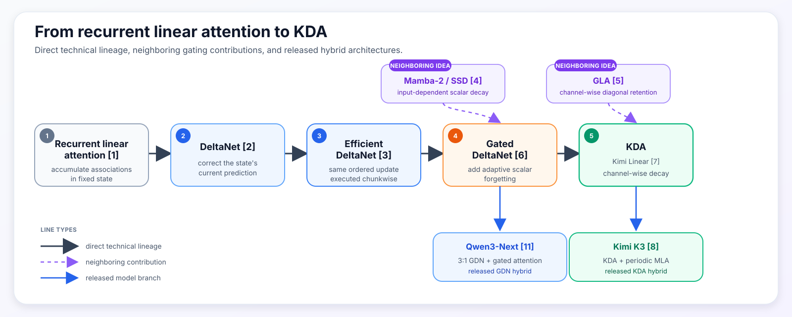
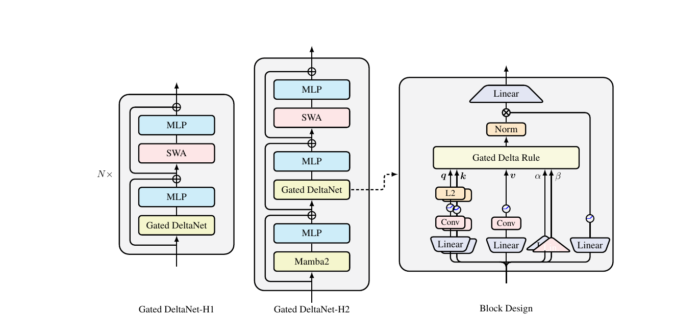
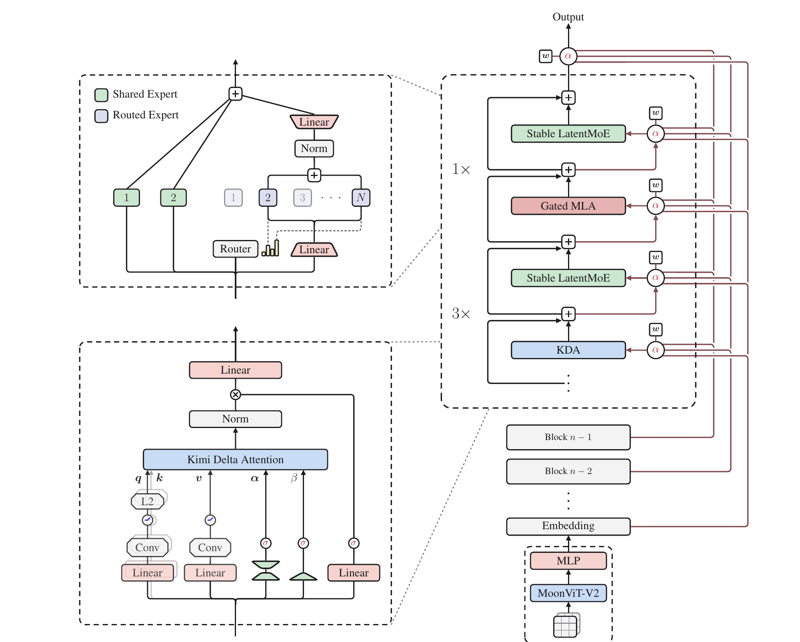
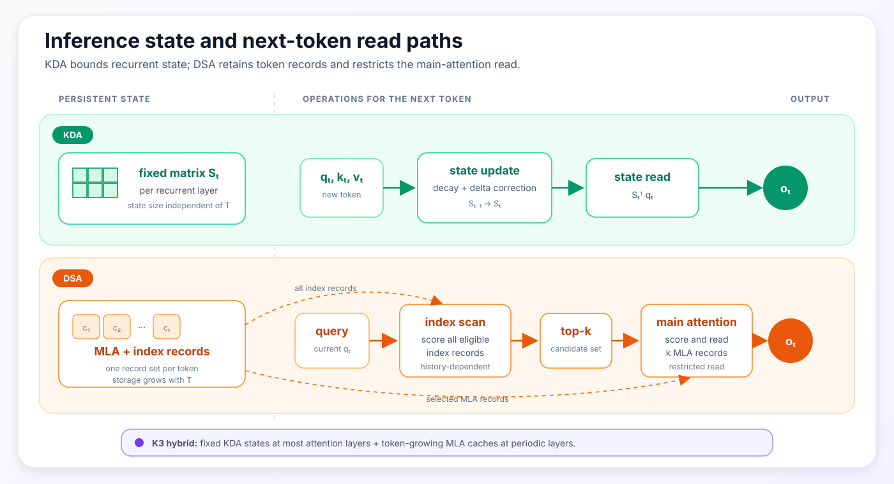

## Scope

This note follows the recurrent-state lineage from linear attention through
DeltaNet and Gated DeltaNet to Kimi Delta Attention (KDA) [1–8]. It then uses
DeepSeek Sparse Attention (DSA) [10] as a contrasting long-context mechanism.
The comparison is limited to four inference-relevant properties: the state
update, the representation retained after each token, cache growth with
sequence length, and the read path used during decoding. It is not a benchmark
comparison between Kimi K3 and DeepSeek-V3.2, which are different model stacks
trained under different conditions.

Dense multi-head attention retains a key and value record for every token and
scores the full history for each new query. Multi-head Latent Attention (MLA)
reduces the channels stored for each token but preserves the sequence of token
records [9]. Its original RoPE-based form also caches a small positional key;
the NoPE form used by Kimi Linear and K3 omits that term [7–9]. KDA instead
folds the history into a fixed-size recurrent matrix. DSA retains MLA records
and inserts a learned selector before the expensive attention operation.

The distinction used throughout the note is therefore between
**storage-time compression** and **read-time selection**. KDA updates a shared
state before future queries are known. DSA preserves token-addressable records
and chooses a top-k subset when the query arrives.

| Mechanism | Persistent representation | Query-time read |
| :--- | :--- | :--- |
| Dense MHA | Full key/value record per token | Every record |
| MLA | A compressed KV latent per token; optionally a positional key | Every token record |
| KDA | One mutable key-to-value map per head | The fixed recurrent state |
| DSA over MLA | Compressed token records plus index records | A selected top-k set |
| K3 hybrid | Fixed KDA states plus MLA records at global-attention layers | KDA state in KDA layers; all token records in each MLA layer |

K3 supplies a concrete hybrid instance: most of its attention layers use KDA,
while periodic MLA layers retain global token-addressable attention [8].
Accordingly, K3 is neither a pure recurrent-linear model nor a conventional
full-attention stack. The fixed-state derivation below establishes the
mechanism used by its recurrent path before the hybrid stack is examined.

## Deriving a Fixed Recurrent State from Linear Attention

Start with a causal attention-like operation using a factorized similarity
kernel:

$$
\kappa(q,k)=\phi(q)^\top\phi(k).
$$

Ignoring normalization for one moment, the output at token $t$ is:

$$
o_t
=
\sum_{i\leq t}\kappa(q_t,k_i)v_i
=
\sum_{i\leq t}
\left[\phi(q_t)^\top\phi(k_i)\right]v_i.
$$

Matrix multiplication is associative, so the query-dependent term can move
outside the historical sum:

$$
o_t
=
\left(
\sum_{i\leq t}\phi(k_i)v_i^\top
\right)^\top
\phi(q_t).
$$

Define a historical state:

$$
S_t
=
\sum_{i\leq t}\phi(k_i)v_i^\top.
$$

Then the whole history can be updated and read recurrently:

$$
S_t=S_{t-1}+\phi(k_t)v_t^\top,
\qquad
o_t=S_t^\top\phi(q_t).
$$

This is the basic result behind recurrent linear attention [1, 2]. A list of
past token interactions becomes one query-independent matrix. Each token adds
an outer product; each query reads the matrix. The matrix contents change with
the sequence, but its dimensions do not.

Normalized linear attention keeps one additional vector:

$$
z_t=z_{t-1}+\phi(k_t),
$$

and reads:

$$
o_t
=
\frac{S_t^\top\phi(q_t)}
{z_t^\top\phi(q_t)}.
$$

The important property is not the absence of normalization. It is the finite
feature-map factorization that lets the model accumulate sufficient statistics
before seeing a future query.

Ordinary softmax attention has a different structure:

$$
o(q)
=
\frac{
\sum_j \exp(q^\top k_j)v_j
}{
\sum_j \exp(q^\top k_j)
}.
$$

Both the contribution of each token and the denominator depend on the current
query. Exact exponential softmax does not generally collapse into the same
finite-dimensional, query-independent state. Approximate feature maps exist;
the distinction here concerns exact access to the stored records.

The database metaphor is useful only up to a point. A softmax key is an
immutable address associated with one cached token. A recurrent-linear key is
a learned direction used to edit a shared function. Its value is a target for
that function, and the query asks what the current function returns in another
direction. None of these directions has to correspond to a human-readable
field or fact.

The recurrent layer's persistent-state size is therefore independent of
sequence length. Its representational constraint is equally direct: every
historical association must coexist inside the same finite matrix.

## KDA Lineage: From Additive State to Channel-Wise Decay

The direct recurrent-update lineage used in this note is:

$$
\text{recurrent linear attention}
\rightarrow
\text{DeltaNet}
\rightarrow
\text{Efficient DeltaNet}
\rightarrow
\text{Gated DeltaNet}
\rightarrow
\text{KDA}.
$$

This is the direct technical trunk used in this note. Mamba-2/SSD and Gated
Linear Attention (GLA) contribute neighboring ideas—scalar adaptive decay and
channel-wise gating—but they are not inserted as fictitious stages in a single
historical chain.



*Figure 1: Solid black arrows trace the direct technical lineage from recurrent linear attention through DeltaNet, Efficient DeltaNet, Gated DeltaNet, and KDA/Kimi Linear. Dotted purple arrows mark neighboring gating contributions; blue arrows connect the mechanisms to released Qwen3-Next and K3 hybrids. Original synthesis based on [1–8, 11].*

### Additive linear attention: unconstrained accumulation

Using the Kimi orientation, let
$S_t\in\mathbb{R}^{d_k\times d_v}$ and read it as $S_t^\top q_t$.
The simplest update is:

$$
S_t=S_{t-1}+k_tv_t^\top.
$$

Every token adds a key-value association. This converts an arbitrarily long
history into fixed-size state, but the update is purely additive. It has no
explicit instruction for replacing an outdated association or clearing space.
State magnitude and cross-talk can accumulate as the sequence grows.

### DeltaNet: prediction-error writes

DeltaNet treats the temporary state as an online key-to-value predictor. For
the current pair $(k_t,v_t)$, define a reconstruction objective:

$$
\mathcal L_t^{\mathrm{inner}}(S)
=
\frac12\left\|S^\top k_t-v_t\right\|_2^2.
$$

One gradient step on the recurrent state with a learned step size $\beta_t$
gives:

$$
\begin{aligned}
S_t
&=S_{t-1}-\beta_t\nabla_S
\mathcal L_t^{\mathrm{inner}}(S_{t-1})\\
&=S_{t-1}
+\beta_tk_t
\left(v_t-S_{t-1}^\top k_t\right)^\top.
\end{aligned}
$$

The term in parentheses is the prediction error [2, 7]. If the state already
returns the desired value, the write is small. If it returns the wrong value,
the update corrects the mapping along $k_t$. For a unit-norm key and
$\beta_t=1$, the state returns the new target immediately after the update.

This inner objective is an interpretation of the forward recurrence. It is not
an auxiliary reconstruction loss added to next-token training. The state is a
sequence-dependent activation, not a persistent model parameter; the language
model loss trains the projections that produce $q$, $k$, $v$, and $\beta$.

### Residual interference with non-orthogonal keys

Write the update contributed by one token as:

$$
\Delta S_t=\beta_tk_te_t^\top,
\qquad
e_t=v_t-S_{t-1}^\top k_t.
$$

At a different key-like direction $k'$, the readout changes by:

$$
(\Delta S_t)^\top k'
=
\beta_te_t(k_t^\top k').
$$

The write is isolated only when the two keys are orthogonal. This is the
geometric source of cross-talk in finite fast-weight memory [2].

Consider a scalar-value example. Let two unit keys overlap by:

$$
k_1^\top k_2=0.6.
$$

Suppose the current state stores $k_1\mapsto1$, so $S_1=k_1$. Before writing
at $k_2$, the state predicts $S_1^\top k_2=0.6$. If the desired value at $k_2$
is zero and $\beta_2=1$, the error is $-0.6$ and:

$$
\Delta S_2=-0.6k_2.
$$

The old read at $k_1$ changes by:

$$
k_1^\top\Delta S_2
=
-0.6(k_1^\top k_2)
=
-0.36.
$$

It falls from $1$ to $0.64$, even though the new write targeted $k_2$.

This is an intuition pump, not an empirical estimate of KDA's error rate. Real
models learn high-dimensional keys, multiple heads, gates, and many layers.
Those features give the model much more capacity to organize memory. They do
not turn each head's fixed matrix into an unlimited collection of immutable
token slots.

### Efficient DeltaNet: exact chunkwise execution

DeltaNet's token-by-token update is natural for autoregressive decoding but
poorly matched to parallel training hardware. Efficient DeltaNet derives an
exact chunkwise form that groups many ordered updates into matrix operations
[3].

Write one transition as:

$$
S_t=F_tS_{t-1}+B_t,
$$

where, for DeltaNet,

$$
F_t=I-\beta_tk_tk_t^\top,
\qquad
B_t=\beta_tk_tv_t^\top.
$$

For two tokens in a chunk:

$$
S_2
=F_2F_1S_{\mathrm{in}}+F_2B_1+B_2.
$$

The order is still present: in general $F_2F_1\neq F_1F_2$. The chunkwise
algorithm computes the same causal transformation without launching one small
recurrent kernel per token. It is an execution improvement for training and
prefill, not a new memory rule and not an approximation that treats writes as
independent. One-token decoding still uses the recurrence.

### Gated DeltaNet: scalar decay plus delta correction

Delta correction can repair the current key direction, but associations that
are never revisited can persist. Gated DeltaNet combines the delta rule with a
learned scalar retention gate [6]:

$$
S_t
=
\alpha_t
\left(I-\beta_tk_tk_t^\top\right)S_{t-1}
+\beta_tk_tv_t^\top,
\qquad
\alpha_t\in(0,1).
$$

The two controls solve different problems. The delta term makes a targeted
correction; $\alpha_t$ can rapidly clear stale state even if the current key
does not match it. The limitation is granularity. A single scalar gives each
head one retention rate at each token. The head cannot preserve one key
feature while quickly refreshing another.

Mamba-2/SSD is relevant here because its structured recurrence also uses an
input-dependent scalar decay and is designed for efficient matrix-oriented
execution [4]. GDN is not simply Mamba-2 renamed: its defining step is the
combination of scalar forgetting with DeltaNet's targeted correction.

### KDA: channel-wise decay plus delta correction

KDA replaces the scalar gate with a vector over key channels [7]:

$$
\alpha_t\in(0,1)^{d_k}.
$$

Its update is:

$$
S_t
=
\left(I-\beta_tk_tk_t^\top\right)
\operatorname{Diag}(\alpha_t)S_{t-1}
+\beta_tk_tv_t^\top.
$$

Left multiplication by $\operatorname{Diag}(\alpha_t)$ scales the rows of
$S_t$, so each key feature can learn a different retention timescale. The
write strength $\beta_t$ remains scalar. KDA makes forgetting channel-wise; it
does not make every part of the write independently gated.

GLA supplies an important precedent. It uses a channel-wise diagonal retention
gate in a matrix-valued recurrent state and provides a hardware-aware chunkwise
algorithm [5]. Its central recurrence is additive after decay, whereas KDA
keeps the delta-correction factor. The shared structure is fine-grained
retention, not an identical memory update.

The update sequence is summarized below:

| Stage | New capability | Remaining pressure |
| :--- | :--- | :--- |
| Recurrent linear attention | Accumulate associations in fixed state | Cannot explicitly edit or forget |
| DeltaNet | Correct the value predicted at the current key | Stale state can persist; writes still interfere |
| Efficient DeltaNet | Evaluate the ordered updates chunkwise | Memory semantics unchanged |
| Gated DeltaNet | Forget a head at an adaptive rate | One timescale for all key channels |
| KDA | Retain key channels at different rates | History still shares one finite matrix |

### ShortConv as a supporting local front end

Practical GDN and KDA blocks do more than apply the recurrence. Their query,
key, and value paths use a small causal convolution before the activation; Q
and K are also L2-normalized [6, 7]. The convolution supplies local token
mixing that the fixed-state mechanism does not model as directly.

Kimi Linear reports a small but non-negligible ablation: in its first-scale
16-head, 16-layer setup, removing the convolution changes training/validation
perplexity from $9.23/5.65$ to $9.29/5.70$ [7]. Gated DeltaNet also reports the
ShortConv as important in its component ablation [6]. This justifies including
it in an exact block diagram. It does not make ShortConv a stage between GDN
and KDA; the recurrent lineage is defined by how $S_t$ changes.



*Figure 2: Gated DeltaNet hybrid layouts and block design. The right-hand panel places ShortConv on the projected Q/K/V paths and separates the recurrent controls from the output gate. Source: Yang, Kautz, and Hatamizadeh [6], Figure 1.*

### Released hybrid branches after GDN

Two released hybrid families share GDN as a recurrent ancestor. Qwen3-Next
reports a 3:1 hybrid of GDN layers and gated standard-attention layers [11].
Kimi Linear instead extends GDN's scalar decay to KDA's channel-wise decay and
interleaves KDA with MLA [7]. K3 scales that KDA–MLA branch [8].

This is a claim about released mechanisms, not either lab's private research
chronology. It also means that Qwen's GDN and Kimi's KDA are close relatives on
the recurrent side, while their full-attention components—gated attention
versus MLA—are a separate architectural comparison.

## K3: The KDA–MLA Hybrid Stack

KDA's fixed state saves memory precisely because old tokens are no longer
independent records. Once their contributions are mixed, a future query can
only read what the current map still represents. This is where MLA enters the
Kimi design.

MLA preserves one token record while compressing its content channels. In the
NoPE form used by Kimi Linear and K3, each token starts with a joint
low-dimensional KV latent:

$$
c_j^{KV}=W^{DKV}h_j.
$$

Learned up-projections define the token's content key and value:

$$
k_j^C=W^{UK}c_j^{KV},
\qquad
v_j^C=W^{UV}c_j^{KV}.
$$

At inference time, this NoPE form caches $c_j^{KV}$ rather than full
head-specific keys and values. The fixed up-projections can be algebraically
absorbed into the query and output projections, so historical K and V do not
need to be materialized [9]. DeepSeek-V2's original MLA additionally caches a
decoupled RoPE key; Kimi's NoPE MLA omits that positional branch [7–9].

MLA therefore compresses *within a token record*. It does not remove the time
axis. Every old position keeps its own latent, and a future query can still
assign a separate softmax score to each position.

Kimi Linear reports that a uniform 3:1 ratio—three KDA layers followed by one
MLA layer—gave the best quality-throughput trade-off among its tested ratios
[7]. In its 16-layer ablation, 3:1 reached validation perplexity 5.65, compared
with 5.66 for 1:1, 5.70 for 7:1, 5.82 for 15:1, and 5.77 for pure MLA. There is
no pure-KDA row. These results support sufficiently frequent global attention
in that setup; they do not establish 3:1 as a universal law.

K3 retains the same broad division of labor. Its released architecture has 69
KDA and 24 Gated MLA layers [8]. The KDA layers perform frequent fixed-state
mixing. The MLA layers periodically provide direct selection over the token
sequence.



*Figure 3: The released K3 architecture. For this note, the relevant path is the repeated block at right: three KDA layers followed by one Gated MLA layer, with the KDA module expanded at lower left. Stable LatentMoE and Attention Residuals are shown for context but are outside this note's scope. Source: Kimi Team [8], Figure 2.*

Kimi Linear and K3 use No Position Encoding (NoPE) in those MLA layers. Their
published design delegates order- and recency-sensitive mixing to KDA while
using MLA for unrestricted global content interaction [7, 8]. This is a
division of labor across the hybrid stack; it should not be read as evidence
that a standalone NoPE MLA layer can infer sequence order from raw token
embeddings.

This note refers to the MLA layers as **addressability checkpoints**. At such a
layer, every token representation at that depth remains separately available,
so later tokens can issue content-specific global queries. This is a
descriptive label used here, not a causal conclusion from an isolated K3
ablation. It has two limits:

1. An MLA layer cannot reconstruct information already destroyed before the
   representation reaches that layer.
2. The MLA cache grows with context, so the complete K3 stack is not
   constant-memory.

K3 also refines the KDA block in two ways. First, it replaces Kimi Linear's
unbounded negative-Softplus log-decay with a scaled sigmoid bounded below by
$g_{\min}=-5$:

$$
\mathbf g_t^h
=g_{\min}\operatorname{Sigmoid}
\left(e^{A_h}\mathbf z_t^h\right),
\qquad
\boldsymbol\alpha_t^h=\exp(\mathbf g_t^h).
$$

Here $A_h$ is a learned per-head log-scale, while $\mathbf z_t^h$ and
$\mathbf g_t^h$ contain one value per key channel.

The published motivation is numerical and computational. KDA's chunkwise form
divides by cumulative decay. Bounding each 16-token tile's cumulative
log-decay keeps the reciprocal inside BF16's exponent range and allows both
diagonal and off-diagonal tiles to use dense Tensor Core operations [8]. It is
not reported as an isolated quality win.

Second, K3 replaces Kimi Linear's low-rank output gate with an input-dependent
full-rank projection:

$$
y_t
=W_o\left[
\operatorname{Sigmoid}(W_gx_t)
\odot
\operatorname{RMSNorm}(\tilde o_t)
\right].
$$

This output gate is different from both recurrent controls:

| Control | Acts on | Role |
| :--- | :--- | :--- |
| $\alpha_t$ | Old recurrent state | Retention of key channels |
| $\beta_t$ | Delta correction | Strength of the current correction |
| Output gate | Retrieved output | Channel filtering before the output projection |

The full-rank gate can expose or suppress channels after the read. It cannot
recover information that the recurrent state has already forgotten. K3 does
not publish a controlled low-rank-versus-full-rank quality ablation, so the
strong supported claim is architectural: the projection is less constrained,
at greater parameter and compute cost. K3 applies the analogous full-rank
sigmoid gate to its MLA outputs as well, giving both paths a common
token-dependent channel filter [8].

## DSA: Top-k Retrieval over MLA Records

DSA puts the bottleneck elsewhere. It is instantiated over MLA, so the model
still retains a compressed latent for every historical token. A lightweight
indexer scores the eligible history:

$$
I_{t,s}
=
\sum_{h=1}^{H_I}
w_{t,h}^I
\operatorname{ReLU}
\left({q_{t,h}^I}^\top k_s^I\right).
$$

The indexer selects a candidate set:

$$
\mathcal T_t
=
\operatorname{TopK}_s(I_{t,s}),
$$

and main attention runs only over those records [10]:

$$
o_t
=
\sum_{s\in\mathcal T_t}
\operatorname{Softmax}_{s\in\mathcal T_t}
\left(q_t^\top k_s\right)v_s.
$$

The indexer score is not the final attention weight. It is a candidate-routing
signal. Main attention independently re-scores the survivors with its own
representations.

This creates asymmetric mistakes. Suppose five records receive index scores:

```text
record        A     B     C     D     E
index score  .91   .84   .80   .22   .10
```

With $k=2$, only A and B reach main attention. Main attention can give almost
all probability to B and suppress A; A then costs a candidate slot but does
not force an incorrect output. If C contained the decisive information, the
error is more serious. Main attention cannot recover C because the selector
made it invisible.

The indexer should therefore optimize candidate recall, while main attention
supplies precision. DeepSeek-V3.2 uses a relatively generous 2,048 selected KV
records per query [10]. That number is a released configuration, not a
universal optimum.

### Training the discrete indexer

The top-k membership decision is discrete. DeepSeek converts a dense MLA model
to DSA in two stages [10].

During **dense warm-up**, dense attention remains active, the backbone is
frozen, and the indexer learns to imitate the dense model's head-aggregated
attention distribution $p_t$:

$$
\mathcal L_{\mathrm{warm}}^I
=
\sum_t
D_{KL}
\left(
p_{t,:}
\,\middle\|\,
\operatorname{Softmax}(I_{t,:})
\right).
$$

The report uses 1,000 steps, totaling about 2.1 billion tokens.

During **sparse adaptation**, top-k selection is enabled. The backbone trains
with language-modeling loss, while the indexer continues to receive a separate
KL objective over the selected set:

$$
\mathcal L_{\mathrm{sparse}}^I
=
\sum_t
D_{KL}
\left(
p_{t,\mathcal T_t}
\,\middle\|\,
\operatorname{Softmax}(I_{t,\mathcal T_t})
\right).
$$

DeepSeek detaches the indexer input from the backbone's computation graph. The
indexer learns from its auxiliary objective; the main model learns from the LM
objective. Dense warm-up matters because once sparse routing begins, an
omitted record has no ordinary main-attention path through which that decision
can be repaired.

### Complexity and retained state

If the sequence has length $L$ and main attention reads $k$ records, its core
pairwise work falls from roughly $O(L^2)$ to $O(Lk)$ during prefill. The
lightweight indexer still scans query-history pairs, so the DeepSeek-V3.2
report retains an $O(L^2)$ indexing component, albeit with fewer heads, small
projections, FP8 execution, and much lower cost than main MLA [10]. During
one-token decoding, the broad index scan remains dependent on the history
length before the top-k read.

Storage does not become constant either. MLA latents and index records still
grow with the number of tokens. DSA primarily reduces how much retained
history the expensive attention path reads; it does not eliminate the retained
history.

## Inference State and Decode Work

Architecture-level inference analysis should keep three quantities separate:

1. persistent state after the prompt;
2. work performed for each generated token;
3. realized wall-clock behavior on a particular kernel and hardware stack.

They are related but not interchangeable.

### Persistent-state growth

For $N_{MLA}$ MLA layers, context length $T$, latent width $d_c$, optional
positional-key width $d_p$, and $b$ bytes per cached value, the
history-dependent cache is approximately:

$$
C_{MLA}(T)
\approx
N_{MLA}T(d_c+d_p)b.
$$

For K3's NoPE MLA, $d_p=0$. RoPE-based MLA retains the additional positional
key, and DSA adds its index records on top of this token-growing cache.

For $N_{KDA}$ recurrent layers with $H$ heads, the persistent matrix states are
approximately:

$$
C_{KDA}
\approx
N_{KDA}H d_kd_v b_s+C_{local},
$$

where $C_{local}$ includes the small local-convolution state and other fixed
bookkeeping. This term does not grow with $T$.

A KDA–MLA hybrid therefore has:

$$
C_{hybrid}(T)
\approx
C_{KDA,fixed}
+N_{MLA}T d_c b.
$$

The hybrid reduces the *slope* of cache growth; it does not remove it. At short
contexts, the fixed recurrent state is not yet well amortized, so the realized
memory advantage can be much smaller than the long-context asymptote.

For one NoPE layer replacement, the approximate cache break-even length is:

$$
T_{\mathrm{cross}}
\approx
\frac{H d_kd_v b_s}{d_c b}.
$$

This is a memory-accounting threshold, not a latency crossover. Fixed local
state, allocator overhead, cache precision, and the full hybrid layer counts
shift the realized point.

DSA retains approximately the same token-growing MLA history plus index data.
Its principal saving is read-side compute and traffic in main attention, not
the removal of token records.



*Figure 4: KDA updates and reads a fixed recurrent state. DSA retains token-growing MLA and index records, scans the index, and restricts main attention to top-k entries. K3 combines fixed KDA states with MLA caches at its global-attention layers. Original synthesis based on [7, 8, 10].*

### Per-token decoding work

::: {.column-page .wide-comparison-table}
| Mechanism | Stored history | Work for the next token | Remaining dependence on context length |
| :--- | :--- | :--- | :--- |
| KDA layer | Fixed recurrent state | Decay, correct, and query the state | None for the recurrent update/read |
| Dense MLA layer | One latent per token | Score/read all token latents | Linear in $T$ |
| DSA over MLA | Latent and index records per token | Broad index scan, then top-k main attention | Indexing and storage still grow with $T$ |
| K3 hybrid | Fixed KDA states plus MLA records | Fixed-state reads in KDA layers and full-history reads in each MLA layer | MLA layers still scale with $T$ |
:::

The table separates the two mechanisms directly: KDA bounds retained token
history at its recurrent layers, whereas DSA bounds the record set inspected
by main attention.

### Short-context performance

Asymptotic complexity does not promise a large gain below 100K tokens. The
fixed KDA state, projections, ShortConv, output gates, MoE layers, kernel
launches, and remaining MLA layers all have costs that do not disappear at
short context. Highly optimized dense attention can also be difficult to beat
when its working set is still modest.

Kimi Linear reports a limited matched-model result. Its 48B comparison reports
prefill performance comparable to MLA at 4K–16K, with a clear separation from
128K onward; it reports $2.3\times$ prefill speedup at 512K and $2.9\times$ at
1M. Figure 7 uses batch size 1 for both its prefill and decode tests, and
reports up to $6\times$ at 1M during decoding [7]. The paper does not provide a
dense, batch-controlled table that establishes one universal sub-100K decode
crossover.

The defensible conclusion is therefore modest. Kimi Linear's hybrid can match
or improve short-context model quality in its matched pretraining evaluations.
Its inference advantage becomes much clearer as the cache and attention-read
costs grow. The exact crossover depends on the model, kernel, hardware, batch,
cache precision, and serving policy.

Lower per-request state can also let more histories fit in accelerator memory,
which may increase batch capacity. That is a system-capacity benefit, not a
guarantee of lower single-user latency. Prefix caching, state checkpoints,
rollback, cache allocation, and scheduling deserve their own serving note.

## Retention and Retrieval Failure Modes

FLOP counts do not identify which historical information remains recoverable.
That property depends on where the architecture makes an irreversible—or at
least difficult to reverse—transformation.

::: {.column-page .wide-comparison-table}
| Mechanism | Retained information | How a needed detail can fail to influence the output | Direct revisit of an old record |
| :--- | :--- | :--- | :--- |
| KDA | One mutable map | Decay, overwrite, or key-space interference | No |
| Dense MLA | One compressed latent per token | Per-token compression or insufficient attention weight | Yes |
| DSA | MLA records, conditionally visible | Indexer omits the record | Yes, if selected |
| K3 hybrid | Fixed states plus periodic MLA records | Recurrent loss or insufficient later global retrieval | At MLA layers |
:::

KDA makes an early commitment. A token is transformed into a contribution to a
shared state before future queries are known. The benefit is fixed storage and
context-independent recurrent-layer decoding. The risk is semantic capacity:
the shared state may no longer represent an exact detail.

DSA makes a later commitment. It keeps the record, scans an inexpensive index,
and hides most records from main attention for the current query. The benefit
is that selected old records remain individually recoverable. The risk is a
selection miss: the evidence exists but is inaccessible at that layer.

This also separates two meanings of capacity:

- **System capacity:** how many request histories fit in hardware memory.
- **Semantic capacity:** how much historical information the model can still
  represent and recover.

KDA helps system capacity by bounding recurrent state growth. The same fixed
state makes semantic capacity an architectural concern. DSA preserves more
explicit token-addressable evidence but continues paying token-growing system
memory.

Neither mechanism removes the cost of compression; it relocates the
information constraint.

## Summary

KDA replaces token-indexed history with a fixed-size matrix state. Delta
correction makes writes conditional on the state's current prediction, while
scalar and then channel-wise decay provide explicit control over retained
state. The resulting recurrent layer has context-independent persistent-state
size, with interference and forgetting as the corresponding representation
constraints.

K3 does not apply that recurrence uniformly. It combines KDA at most attention
layers with periodic Gated MLA layers, so its complete cache contains both
fixed recurrent states and token-growing latent records.

DSA retains token-addressable MLA and index records. Its indexer scans the
eligible history, selects top-k candidates, and limits the expensive main
attention read to that set. Storage still grows with context length, and a
selector miss can hide a retained record from the current layer.

The mechanisms therefore differ along three concrete inference properties:
persistent-state growth, the operations required for the next-token read, and
the point at which historical information can become inaccessible. Those
properties do not by themselves determine model quality or a universal
latency crossover.

## References {.unnumbered}

::: {.references-list}
1.  Katharopoulos, A. et al. (2020). *Transformers are RNNs: Fast Autoregressive Transformers with Linear Attention.* [arXiv:2006.16236](https://arxiv.org/abs/2006.16236)
2.  Schlag, I., Irie, K. & Schmidhuber, J. (2021). *Linear Transformers Are Secretly Fast Weight Programmers.* [arXiv:2102.11174](https://arxiv.org/abs/2102.11174)
3.  Yang, S. et al. (2024). *Parallelizing Linear Transformers with the Delta Rule over Sequence Length.* [arXiv:2406.06484](https://arxiv.org/abs/2406.06484)
4.  Dao, T. & Gu, A. (2024). *Transformers are SSMs: Generalized Models and Efficient Algorithms Through Structured State Space Duality.* [arXiv:2405.21060](https://arxiv.org/abs/2405.21060)
5.  Yang, S. et al. (2024). *Gated Linear Attention Transformers with Hardware-Efficient Training.* [arXiv:2312.06635](https://arxiv.org/abs/2312.06635)
6.  Yang, S., Kautz, J. & Hatamizadeh, A. (2025). *Gated Delta Networks: Improving Mamba2 with Delta Rule.* [arXiv:2412.06464](https://arxiv.org/abs/2412.06464)
7.  Kimi Team (2025). *Kimi Linear: An Expressive, Efficient Attention Architecture.* [arXiv:2510.26692](https://arxiv.org/abs/2510.26692)
8.  Kimi Team (2026). *Kimi K3: Open Frontier Intelligence.* [arXiv:2607.24653](https://arxiv.org/abs/2607.24653)
9.  DeepSeek-AI (2024). *DeepSeek-V2: A Strong, Economical, and Efficient Mixture-of-Experts Language Model.* [arXiv:2405.04434](https://arxiv.org/abs/2405.04434)
10. DeepSeek-AI (2025). *DeepSeek-V3.2: Pushing the Frontier of Open Large Language Models.* [arXiv:2512.02556](https://arxiv.org/abs/2512.02556)
11. Qwen Team (2025). *Qwen3-Next: Towards Ultimate Training & Inference Efficiency.* [Official technical post](https://qwen.ai/blog?id=e34c4305036ce60d55a0791b170337c2b70ae51d)
:::
