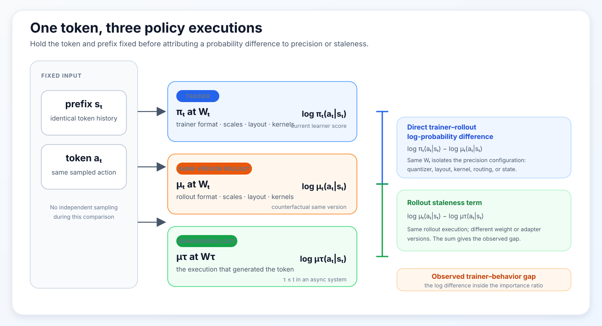
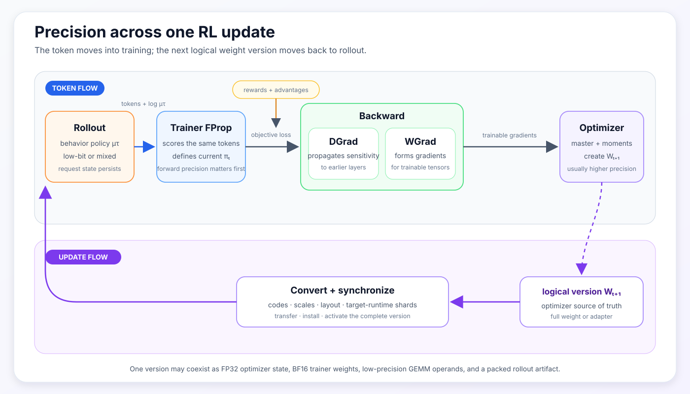
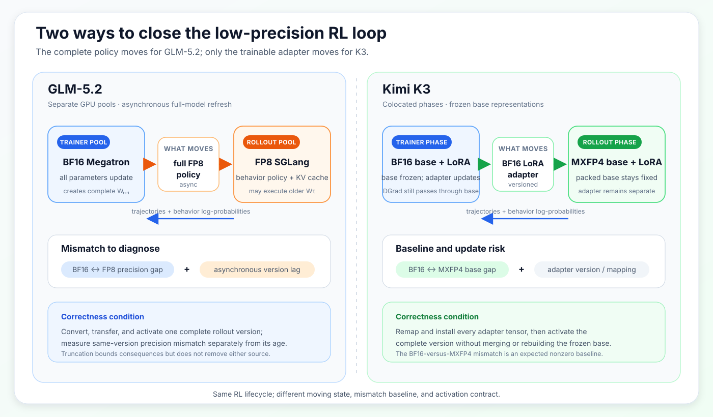

## Scope

This became concrete for me while working on continual post-training built on
top of GLM-5.2 and Kimi K3. The difficult questions were not simply whether a
model could be loaded in FP8 or MXFP4. They were whether the trainer and
rollout engine represented the intended policy, whether an update became
visible in the correct form, and whether an observed mismatch came from
quantization, stale weights, routing, model state, or an implementation bug.

Low precision is often introduced as a hardware optimization. Smaller weights
use less memory, lower-precision Tensor Cores can execute more arithmetic, and
compressed checkpoints are easier to place across a cluster. Those benefits
matter, but they do not capture what makes low precision unusual in language
model reinforcement learning.

An RL system normally executes the policy in at least two places. A rollout
engine generates tokens and records their probabilities. A training engine
later scores those tokens, constructs an objective, and updates the model. Even
when both engines use the same weight version, differences in precision,
scaling, kernels, routing, or weight conversion can make their output
probabilities differ.

That difference does not automatically make the RL update invalid. It does
mean that we need to identify which policy generated the data, which policy the
trainer evaluates, and how a new weight or adapter version reaches rollout.

This post develops the topic in three parts:

1. the conceptual foundation: why RL has separate rollout and training
   executions, and why numerical differences matter;
2. the systems view: how precision enters rollout, FProp, DGrad, WGrad,
   optimizer state, and live synchronization;
3. the practical view: what GLM-5.2 and Kimi K3 reveal about correctness,
   memory, hardware, and model-specific support.

The narrative follows two objects through the same RL cycle: a sampled token
moves from rollout into training, while an updated weight or adapter moves
from training back to rollout.

Low-precision RL works when we can identify, measure, and control both paths.

## One Token, Two Executions

For a prefix $s_t$, the rollout engine samples a token from a behavior policy:

$$
a_t\sim\mu(\cdot\mid s_t).
$$

The generated token is now part of the training data. The trainer feeds the
same token and prefix through its current policy and recomputes:

$$
\log\pi_\theta(a_t\mid s_t).
$$

Many RL objectives compare the two policies through a ratio:

$$
\rho_t
=
\frac{\pi_\theta(a_t\mid s_t)}
     {\mu(a_t\mid s_t)}
=
\exp\left(
\log\pi_\theta(a_t\mid s_t)
-
\log\mu(a_t\mid s_t)
\right).
$$

If the policy has changed because of an optimizer update, a ratio away from one
is expected. In an asynchronous system, the rollout policy may also be several
versions behind the trainer. But the trainer and rollout engine can disagree
even at the same weight version.

Let $\pi_t$ be the current trainer policy, and let $\mu_\tau$ be the
behavior policy that generated the token, where $\tau\leq t$. To separate
two common causes of disagreement, define $\mu_t$ as the policy the rollout
engine would execute after receiving weight version $t$. For the same token
and prefix:

$$
\begin{aligned}
\log\pi_t(a_t\mid s_t)
-
\log\mu_\tau(a_t\mid s_t)
=
\underbrace{
\log\pi_t(a_t\mid s_t)
-
\log\mu_t(a_t\mid s_t)
}_{\text{same-version precision mismatch}}
+
\underbrace{
\log\mu_t(a_t\mid s_t)
-
\log\mu_\tau(a_t\mid s_t)
}_{\text{rollout staleness}}.
\end{aligned}
$$

The first term is the **same-version precision mismatch**. The second is
**rollout staleness**. The algebra is exact only when all three scores refer to
the same token and prefix. It is still a debugging decomposition rather than a
promise that the two causes can be measured independently. In a nonlinear
model, an early numerical difference can change a router decision or recurrent
state, which then changes the later computation path.

MoE models make this especially visible. If two router scores lie close to a
top-$k$ boundary, a small quantization change can select a different expert.
The resulting difference is no longer only a slightly perturbed matrix
multiplication. The two executions have entered different branches of the
model.

The first low-precision RL question is therefore:

> How much of the trainer–rollout log-probability gap comes from the precision
> configuration, and how much comes from rollout staleness?

Three related diagnostics should remain separate:

| Diagnostic | Comparison | What it answers |
| :--- | :--- | :--- |
| Direct trainer–rollout log-probability difference | $\log\pi_t(a_t\mid s_t)-\log\mu_t(a_t\mid s_t)$ for identical tokens and prefixes | How large is the same-version mismatch? Report absolute differences, tails, token-position dependence, and routing agreement rather than only a signed mean. |
| Trainer–rollout KL diagnostic | The same trainer and rollout policies, aggregated over sampled tokens | Does the end-to-end gap remain near an established baseline or grow over time? This is a diagnostic unless the objective explicitly uses it. |
| Reference-policy KL | The trained or quantized policy versus a separate reference policy, often BF16 | How far has the policy moved from that reference? It does not directly measure trainer–rollout agreement. |

: Probability diagnostics used to separate trainer–rollout agreement from movement relative to a reference policy. {#tbl-probability-diagnostics}

Figure 1 expands the first row of @tbl-probability-diagnostics. Its
trainer-to-same-version-rollout edge is the direct log-probability difference;
the second edge adds rollout staleness. The trainer–rollout KL in the second
row aggregates the same policy pair over tokens, while the reference-policy KL
in the third row uses a separate reference and is not part of the figure.

The importance ratio is constructed from the first comparison. A clipping or
truncation statistic then reports how often that ratio reaches the objective's
control boundary. It measures a consequence of mismatch; it does not identify
whether the cause is precision or staleness.

*Figure 1: Holding the token and prefix fixed separates the observed trainer–behavior gap into a same-version precision mismatch and rollout staleness. The decomposition is exact for the three displayed scores; routing and state differences remain possible causes inside the measured terms. Original synthesis.*

## From One Linear Layer to an RL Update

Before following a full RL update, it helps to make the word *precision* more
specific. A number format is only one part of a quantization scheme.

### Format, scale, and execution

Consider a high-precision value $x$ represented on a lower-precision grid:

$$
\widehat{x}
=
s\,Q\left(\frac{x}{s}\right),
$$

where $Q$ rounds and clamps to the available codes and $s$ determines which
real values those codes cover.

The format determines the local number system. The scale moves that number
system to a useful range. Scale grouping determines which values must share
that range. One tensor-wide scale, one scale per row, one scale per block, and
one scale per token can produce different reconstructed values even when the
payload format is unchanged.

In this post, **format** means the encoded datatype, such as FP8 or MXFP4. A
**quantization scheme** includes the format, scale grouping, rounding, and
exceptions. A **precision configuration** says where those schemes are used in
rollout and training. The final component, **convert and synchronize**, says
how a new weight or adapter version becomes an active rollout representation.

A concrete toy example shows why scale grouping matters. Consider a signed
INT4 quantizer with integer codes from $-7$ to $7$. If the values $1$, $3$,
and $100$ share one scale, preserving $100$ requires
$s=100/7\approx14.3$. Both $1$ and $3$ then round to code zero, while $100$
is reconstructed exactly. If $1$ and $3$ form a separate group, its scale can
be $s=3/7\approx0.43$: $3$ remains exact and $1$ reconstructs to about
$0.86$ instead of zero. Finer groups preserve local resolution, but they also
require more scale metadata and more scale computation.

Even after choosing a format, an implementation still has to decide how
values are scaled, which representations persist between operations, what
actually reaches the GEMM, and what crosses a communication boundary.

Concretely, a precision description should make five decisions explicit:

- **Encoded values and scales:** FP8, MXFP4, or INT4 payloads are incomplete
  descriptions without tensor, row, block, token, or expert-level scale
  organization.
- **GEMM operands:** a real FP8 GEMM consumes FP8 operands and scales, whereas
  a fake-quantized path reconstructs values and sends BF16 operands to the
  GEMM.
- **Accumulation and output:** products may be accumulated or materialized in
  BF16 or FP32 even when their input operands are low precision.
- **Persistent representation:** the copy that survives between operations
  may be an optimizer master, a trainer parameter, or a packed rollout weight.
- **Communication representation:** ranks or runtimes may exchange BF16, FP8,
  packed low-bit weights, or only adapter tensors.

A format name alone answers only part of the first decision.

This is why an FP8 GEMM does not imply an entirely FP8 model. The persistent
trainer weight, optimizer moments, residual stream, normalization layers, GEMM
outputs, and selected sensitive operations may all remain wider.

The main configurations discussed later use the following numerical
representations. These rows describe the cited systems rather than universal
definitions of each format [1–5, 7].

::: {.column-page}
| Configuration | Encoded values | Scale organization | Where it is executed |
| :--- | :--- | :--- | :--- |
| Blockwise FP8 | E4M3 weights and activations | FP32 scales; $1\times128$ activation tiles and $128\times128$ weight blocks in Unified FP8 | SGLang rollout and eligible Transformer Engine trainer GEMMs on Hopper |
| INT4 QAT / W4A16 | INT4 weights with BF16 activations | grouped weight scales; packing follows the rollout kernel | weight-resident SGLang rollout, with QDQ values consumed by BF16 trainer GEMMs |
| MXFP8 | E4M3 values | one E8M0 scale for every 32 consecutive values | rollout and eligible trainer GEMMs on Blackwell |
| MXFP4 | E2M1 values in a packed model-specific layout | one E8M0 scale for every 32 consecutive values | K3's frozen rollout base on Blackwell |
| NVFP4 | E2M1 values | one E4M3 scale per 16 values plus an outer FP32 scale | selected routed-expert rollout and trainer FProp GEMMs on Blackwell |

: Formats and scale organizations used by the low-precision configurations discussed in this post. {#tbl-format-configurations}
:::

The hardware generation then determines which of those representations have
a native execution path. Hopper provides the natural starting point for
blockwise FP8 training and W4A16 rollout, but not the Blackwell microscaling
paths. Blackwell adds native MXFP8 and NVFP4 paths, together with packed MXFP4
rollout where the model kernels support it. In either case, hardware support
does not guarantee model, kernel, framework, or complete RL support.

Three lessons follow. Low-bit storage is not the same as low-bit computation;
native hardware support is not the same as complete model support; and peak
Tensor Core throughput is not full RL-step throughput. Scale construction,
transposes, packing, communication, small RL microbatches, ragged expert
GEMMs, and launch gaps can dominate the measured system.

### FProp, DGrad, and WGrad

The names FProp, DGrad, and WGrad are easiest to understand by starting from an
ordinary forward and backward pass. For one linear layer, the forward pass maps
input activations $X$ and weights $W$ to output activations $Y$:

$$
Y=XW^\top.
$$

Later layers turn $Y$ into a scalar loss $L$. When backpropagation reaches this
layer, it supplies the upstream gradient
$G_Y=\partial L/\partial Y$. The layer must then compute two different
derivatives:

$$
G_X
=
\frac{\partial L}{\partial X}
=
G_YW,
$$

$$
G_W
=
\frac{\partial L}{\partial W}
=
G_Y^\top X.
$$

The first computation is **DGrad**: it produces $G_X$, which carries the
learning signal into earlier layers. The second is **WGrad**: it produces
$G_W$, which tells the optimizer how this layer's weights should change.
**FProp** is the original computation of $Y$. These three matrix
multiplications consume different operand pairs:

- FProp uses $X$ and $W$;
- DGrad uses $G_Y$ and $W$;
- WGrad uses $G_Y$ and $X$.

FProp determines the numerical function used to score the current tokens.
DGrad and WGrad determine how that score changes the model. The distinction is
important because a precision configuration does not have to treat all three
computations identically.

For example, a trainer can match a quantized rollout in FProp while keeping
DGrad and WGrad in BF16. That aligns the policy used to score the current
tokens without claiming four-bit or eight-bit backward computation. Backward
precision still matters, but it affects the update and therefore future
policies rather than the probabilities already used in the current objective.

This asymmetric case motivates **fake quantization**. Suppose rollout executes
low-bit weights, but the trainer still uses BF16 GEMMs. The trainer can
quantize and immediately dequantize its operands before the matrix
multiplication:

$$
Y_{\mathrm{fake}}
=
DQ(Q(X))DQ(Q(W))^\top.
$$

The forward computation now contains real quantization error because it sees
values reconstructed from the low-precision grid, but the GEMM itself still
consumes BF16 operands. This lets us match or approximate the rollout's
quantized forward function without requiring a low-bit trainer kernel. If the
quantized weights are trainable, quantization-aware training also needs a rule
for propagating gradients through rounding, commonly a straight-through
estimator.

### Tracing one RL update

The complete RL update adds rollout, optimizer state, and synchronization to
the three trained-linear operations. The rollout engine first extends each
prefix with behavior policy $\mu_\tau$ and returns the sampled tokens together
with their behavior log-probabilities. Rewards are then evaluated and converted
into returns or advantages. Trainer FProp feeds the same prefixes and sampled
tokens through the current policy $\pi_t$, which is the point at which trainer
precision directly enters the probability ratio.

The RL objective combines the current and behavior log-probabilities with the
advantages, clipping or truncation, and any reference-policy KL term. It
produces the scalar loss that drives backward, but it does not introduce a new
weight representation. For the precision trace, it is therefore the bridge
between Trainer FProp and the two backward computations: DGrad propagates
sensitivity into earlier layers, while WGrad forms gradients for the tensors
that are actually trainable.

| Component | Main question |
| :--- | :--- |
| Rollout | Which behavior policy generated the tokens and request state? |
| Trainer FProp | How does the current trainer policy score the same tokens? |
| DGrad | Which weight representation propagates sensitivity backward? |
| WGrad | Which activation representation forms gradients for the trainable tensors? |
| Optimizer | Which parameter and moment representations create $W_{t+1}$? |
| Convert and synchronize | How does $W_{t+1}$ become a complete, active rollout version? |

: Components used to trace precision across one RL update. {#tbl-rl-loop-components}

The optimizer consumes those gradients and its persistent parameter and moment
state to create $W_{t+1}$, or a new adapter version. **Convert and
synchronize** covers everything required to turn that logical update into the
next rollout representation: quantization, scale construction, padding,
packing, tensor fusion, target-runtime sharding, transfer, installation, and
activation. Keeping these actions in one component makes its contract clear:
the rollout engine should expose one complete new version, not a mixture of old
and new tensors.

The weights are not the only state in this process. The trainer maintains
optimizer state and saved activations. Autoregressive generation maintains
request state, including the accepted prefix, KV cache, recurrent or
convolution state, and sometimes routing or draft-model state. A request must
remain paired with the weight or adapter version used to score and extend it.

Figure 2 follows the same component sequence as @tbl-rl-loop-components. The
token and its behavior log-probability move through rollout and trainer FProp;
rewards and advantages enter the objective as a side input; the resulting loss
drives DGrad and WGrad; and the optimizer's next logical version returns
through conversion and synchronization. The objective is shown on the bridge
between components rather than as a seventh component.

*Figure 2: The same six components from Table 3, arranged as a cycle. The token moves from rollout into training; the optimizer creates the next logical version, which is converted and synchronized back to rollout. Original synthesis.*

The same $W_t$ may exist simultaneously as an FP32 optimizer master, a BF16
trainer parameter, rowwise and columnwise quantized GEMM operands, and a packed
rollout tensor. These are representations of one weight version, not four
different updates. The version changes when the optimizer creates
$W_{t+1}$.

## Where Precision Enters the RL Step

The previous section separated format, execution, hardware, and the components of
an RL update. We can now combine them. A **precision configuration** assigns a
representation and execution mode to rollout, FProp, DGrad, WGrad, optimizer
state, and conversion and synchronization. @tbl-precision-configurations compares five
published configurations that make different choices at those boundaries.

::: {.column-page}
| Precision configuration | Rollout | FProp | DGrad | WGrad | Optimizer | Convert and synchronize |
| :--- | :--- | :--- | :--- | :--- | :--- | :--- |
| Unified FP8 [1] | matching blockwise FP8 | real blockwise FP8 for eligible GEMMs | real blockwise FP8 for eligible GEMMs | real blockwise FP8 for eligible GEMMs | higher-precision master and moments | rebuild and transfer the matching blockwise-FP8 policy |
| INT4 QAT / W4A16 [2] | real W4A16 | BF16 GEMM over QDQ weights | BF16 using reconstructed weights | BF16 from saved activations; STE passes the gradient through weight quantization | higher precision | quantize and pack updated INT4 weights |
| MXFP8 [3] | matching MXFP8 | real MXFP8 for eligible GEMMs | real MXFP8 for eligible GEMMs | real MXFP8 for eligible GEMMs | higher precision | rebuild codes, scales, layouts, and exceptions |
| Selective NVFP4 [3, 4] | NVFP4 routed experts with wider exceptions | real NVFP4 expert GEMMs | BF16 using original or reconstructed weights | BF16 using original or reconstructed activations | higher precision | reproduce the quantizer, layout, and specified exceptions |
| Frozen low-bit base with BF16 LoRA [5] | packed low-bit base plus BF16 adapter | wider frozen weights plus BF16 adapter | wider sensitivity through the base and adapter paths | adapter tensors only | adapter state only | synchronize the adapter; leave the rollout base unchanged |

: Precision placement across the low-precision RL configurations discussed in this post. {#tbl-precision-configurations}
:::

The table should not be read as a ranking or as a promise of equal treatment
in the rest of the post. It is a map of the precision configurations. Unified FP8 is traced
in detail below because it provides a clean example of how to follow precision
through the entire RL step. The other rows remain comparison points and return
at different depth in the model-specific sections.

Unified FP8 and MXFP8 try to align rollout and trainer execution while also
using native low-precision trainer GEMMs. INT4 QAT adapts a higher-precision
trainer to a low-bit rollout function without claiming INT4 backward speed.
The published NVFP4 example uses four-bit expert execution in the forward path
while keeping a wider backward for stability. LoRA over frozen base weights
changes the final component: instead of converting and moving the full model
after every optimizer step, it moves only the trainable adapter.

### Unified FP8 as a complete trace

The term **Unified FP8** follows the configuration introduced in *Unified FP8:
Moving Beyond Mixed Precision for Stable and Accelerated MoE RL* [1]. Here it
means that rollout and trainer FProp target the same blockwise-quantized policy
while eligible trainer FProp, DGrad, and WGrad GEMMs execute in FP8. It does
not mean that every tensor, operation, or persistent state is FP8.

This configuration is a useful complete trace because it exposes three
questions that a format label tends to collapse: which quantized values define
the forward policy, which kernels actually consume FP8 operands, and which
representation persists or crosses a runtime boundary.

#### Matching the forward comes first

The published Hopper setup uses an SGLang blockwise FP8 rollout policy and
Transformer Engine blockwise FP8 for eligible trainer GEMMs. Both use E4M3
values with FP32 scales, $1\times128$ activation tiles, and
$128\times128$ weight blocks. Accumulation, normalization, residual paths,
optimizer state, and unsupported operations can remain wider [1, 10].

The two block shapes reflect different statistics. An activation matrix is
organized as token-like rows by hidden channels. A $1\times128$ tile gives
each token row its own scale for every 128 adjacent channels, so an outlier in
one token does not reduce the resolution available to neighboring tokens. A
weight matrix has two stable structural axes and is reused across many tokens;
a $128\times128$ block can therefore share one scale across a small two-
dimensional region with much lower metadata overhead. The common dimension of
128 aligns both schemes with chunks of the GEMM inner dimension, but the outer
shape differs because activations and weights have different reuse patterns.

That shared quantizer is not enough by itself to establish what matters. The
Unified FP8 study uses four trainer variants to separate three variables:
whether FProp sees quantized values, whether backward sees quantized values,
and whether the GEMM kernel consumes BF16 or FP8 operands. Rollout remains
blockwise FP8 in every case.

| Trainer case | FProp | DGrad and WGrad | Comparison isolated |
| :--- | :--- | :--- | :--- |
| BF16 baseline | ordinary BF16 values and GEMMs | ordinary BF16 | original same-version BF16-trainer/FP8-rollout mismatch |
| Forward fake quantization | QDQ values followed by BF16 GEMMs | ordinary BF16 | effect of matching the quantized forward values |
| Forward and backward fake quantization | QDQ values followed by BF16 GEMMs | QDQ operands followed by BF16 GEMMs | additional effect of quantized backward values without FP8 kernels |
| Real FP8 | blockwise FP8 operands and FP8 GEMMs | FP8-capable DGrad and WGrad | fake-versus-real execution after the represented values are aligned |

: Controlled trainer variants in the Unified FP8 study; rollout remains blockwise FP8 in all four cases. {#tbl-unified-fp8-ablations}

In the **BF16 baseline**, the trainer and rollout can hold the same logical
weight version and still score different policies: trainer FProp evaluates
ordinary BF16 values, while rollout evaluates quantized weights and
activations. This is the original same-version precision mismatch.

With **forward fake quantization**, the trainer applies the rollout-like QDQ
operation to its forward operands and then uses a BF16 GEMM. Backward remains
ordinary BF16. This variant deliberately changes the policy scored by the
trainer without attempting an FP8 training speedup. Comparing it with the BF16
baseline asks whether forward-value alignment alone is sufficient to reduce
the trainer–rollout discrepancy.

The third variant applies **fake quantization in forward and backward**.
DGrad and WGrad now see reconstructed FP8-grid values, but their GEMMs remain
BF16. Comparing the second and third variants isolates how quantized backward
values change optimization. They can affect gradient quality and future
updates, but they do not retroactively change the forward probabilities used
for the current trajectory.

Finally, **real FP8** gives eligible FProp, DGrad, and WGrad operations FP8
codes and scales and executes FP8 Tensor Core GEMMs. Comparing the third and
fourth variants holds the represented grid values approximately fixed while
changing the kernel, layout, accumulation, and conversion path.

The study reports that the three variants with a quantized trainer forward
have much better trainer–rollout agreement than the ordinary BF16 baseline
[1]. At the same time, their KL to a BF16 reference can be higher because that
metric also counts the intentional movement from a BF16 policy to a quantized
one. This is why @tbl-probability-diagnostics separates trainer–rollout
agreement from reference-policy KL.

The fake-versus-real comparison supplies another useful debugging rule. If a
BF16 GEMM over QDQ operands agrees with a real FP8 GEMM, but both differ from
the unquantized BF16 baseline, the dominant change is information lost during
quantization. If fake and real paths disagree with each other, kernel layout,
accumulation order, scale application, or another execution detail becomes a
more likely cause. Matching FProp comes first because FProp defines the policy
used in the current objective; backward precision determines how that policy
will learn next.

#### Real FP8 GEMMs are only one part of the configuration

Real FP8 GEMMs still coexist with several wider or differently packed
representations. In a Megatron trainer configured to use Transformer Engine,
`--transformer-impl transformer_engine`, `--fp8-format e4m3`, and
`--fp8-recipe blockwise` select blockwise FP8 execution for supported
Transformer Engine operators. Transformer Engine performs the online operand
quantization, manages FP8 metadata, and invokes eligible FP8 forward and
backward GEMMs. Megatron still owns model partitioning, the training schedule,
parameter gathering, and optimizer integration.

Several representations therefore coexist, each for a different reason.

**Optimizer source of truth.** Higher-precision master parameters and moments
remain responsible for producing the next logical weight version. Real FP8
GEMMs do not imply that the optimizer applies updates directly to an E4M3
payload.

**Persistent trainer parameters.** The trainer's primary parameter is BF16 by
default, while eligible FP8 primary weights are optional. This representation
belongs to parameter ownership and distributed gathering; it is distinct from
the online operands consumed by a GEMM.

**Compute operands and wider exceptions.** Transformer Engine constructs
blockwise-FP8 operands and scale metadata for supported FProp, DGrad, and WGrad
GEMMs. Norms, residual paths, embeddings, the language-model head, custom
architecture operators, and selected sensitive operations can remain BF16 or
FP32. FP8 codes and scales, transposed operand copies, workspaces, saved
activations, and higher-precision optimizer state also explain why end-to-end
memory does not shrink in direct proportion to the payload width.

The optional `--fp8-param-gather` flag is a useful example of why these
representation boundaries must remain separate. Without it, eligible primary weights
and their data-parallel AllGather can remain BF16; Transformer Engine
quantizes them online into operands for real FP8 GEMMs. With it, supported
primary weights and the AllGather use FP8. The eligible GEMMs are real FP8 in
both cases, while master parameters and optimizer moments remain wider. The
flag therefore changes trainer parameter storage and communication rather than
defining whether FProp, DGrad, or WGrad is FP8. In the referenced stack, this
option requires the Transformer Engine FusedAdam path and is incompatible with
Megatron CPU Adam offload [10].

**Rollout and recovery representations.** In the convert-and-synchronize
component, the referenced Miles integration can use a BF16 interoperability
bridge before SGLang constructs its blockwise-FP8 runtime layout. Its
distributed checkpoint is also BF16 [10]. The bridge, rollout artifact, and
checkpoint serve different consumers; none determines whether the trainer's
eligible GEMMs execute in FP8.

The value of tracing Unified FP8 this way is precisely that “FP8” no longer
hides which RL component, numerical representation, or framework owns a
particular behavior.

## Closing the Loop at Frontier-Model Scale

Unified FP8 is the cleanest case: rollout and trainer FProp can target the same
quantized policy. Frontier-scale systems do not always have that option. Model
size, checkpoint format, available kernels, and synchronization cost can force
the two runtimes to keep different representations. GLM-5.2 and Kimi K3 show
two ways to close the RL loop under those constraints.

GLM-5.2 updates the complete model and accepts both BF16-versus-FP8 precision
mismatch and asynchronous version lag. K3 instead freezes different base
representations in the two runtimes and makes a BF16 adapter the only moving
state. Reading the cases through the component trace in
@tbl-rl-loop-components makes the contrast much sharper than their format
names alone.

### GLM-5.2: BF16 training and FP8 rollout

The GLM-5.2 continual post-training configuration pairs a BF16 Megatron
trainer with an FP8 SGLang rollout engine on separate GPU pools [6]. The
rollout side also uses an FP8 E4M3 KV cache. Model-weight precision and cache
precision are separate decisions: one changes the executed network, while the
other changes how attention state is stored during generation. In the
component trace from Section 3.3, rollout is FP8, trainer FProp, DGrad, and
WGrad are BF16, the optimizer updates all parameters from higher-precision
state, and conversion and synchronization perform an asynchronous full-weight
refresh.

The separate pools let rollout and training proceed concurrently, but that
choice creates two independent sources of off-policy behavior. Even at the
same weight version, BF16 trainer FProp and FP8 rollout can disagree. While the
next full rollout artifact is being converted and transferred, active workers
may also continue generating from an older version. Applying the decomposition
from Section 2, the first effect is same-version precision mismatch and the
second is rollout staleness. Both enter the same importance ratio, but they
require different measurements and interventions.

Truncated importance sampling can limit the effect of extreme ratios on the
update. It does not make the BF16 trainer equal to the FP8 rollout engine,
restore the stale behavior policy, or prove that both systems selected the
same experts. Precision mismatch and rollout staleness still need separate
diagnostics: fixed-prefix same-version scoring for the first, and explicit
rollout-version age for the second.

### Kimi K3: packed MXFP4 rollout weights and a BF16 adapter

K3 starts from a different constraint. Its released rollout checkpoint is a
packed MXFP4 representation of a 2.8-trillion-parameter model. Merging an
adapter into a complete BF16 base, requantizing the full model, and
redistributing a new MXFP4 artifact after every optimizer step would make the
full base the moving state. The disclosed RL configuration avoids that path
[5].

The Megatron trainer keeps a frozen BF16 base, while SGLang executes the
frozen packed MXFP4 base directly on Blackwell. A BF16 LoRA adapter is the only
trainable representation shared between them. The two runtimes therefore do
not agree on the numerical base, but they do agree on what changes.

The disclosed workflow also uses a different schedule from GLM-5.2. Rather
than assigning rollout and training to dedicated asynchronous pools, it
colocates them and alternates rollout-active and trainer-active phases. That
removes the same kind of concurrent full-model refresh, but it does not remove
the version boundary: every rollout worker must still switch to one complete
adapter version before the next trajectories are generated.

For one adapted projection:

$$
Y_T
=
\mathcal L_T(X_T;W_{\mathrm{BF16}})
+
\frac{\alpha}{r}X_TA_t^\top B_t^\top,
$$

$$
Y_R
=
\mathcal L_R(X_R;W_{\mathrm{MXFP4}})
+
\frac{\alpha}{r}X_RA_t^\top B_t^\top.
$$

Here $\mathcal L_T$ is the trainer's BF16 base operation and $\mathcal L_R$
is SGLang's packed MXFP4 operation. The separate $X_T$ and $X_R$ are
important: earlier BF16 and MXFP4 layers may already have produced different
hidden states. These equations describe one adapted projection, not an
additive decomposition of the complete nonlinear model. In the same component
trace, rollout uses the packed MXFP4 base plus BF16 LoRA, trainer FProp and
DGrad use the frozen BF16 base plus LoRA, WGrad and the optimizer cover only
the adapter, and synchronization installs the adapter without rebuilding the
frozen rollout base.

Freezing the base removes its WGrad and optimizer state; it does not remove the
base from backpropagation. DGrad must still pass sensitivity through the frozen
linear operation so that earlier adapted layers receive a learning signal.
The base participates in the derivative with respect to activations without
receiving a parameter update.

“Only the adapter moves” still describes a distributed model update. Megatron
adapter shards must be reconstructed into the rollout TP/EP ownership and
tensor layouts, transferred in bounded groups, installed, and acknowledged.
The rollout must activate adapter version $t+1$ only after all of its tensors
have been installed; otherwise one trajectory can observe a mixture of adapter
versions $t$ and $t+1$. Successful byte transfer alone does not prove that
the rollout kernel reads the new adapter.

This architecture changes the validation target. A same-version
BF16-versus-MXFP4 probability gap is expected before the first adapter update.
The relevant question is whether that gap stays near its measured baseline
after synchronization. A sudden change can indicate a missing tensor, an
incorrect TP/EP mapping, a mixed adapter version, or a rollout kernel that did
not activate the installed adapter. KDA recurrent state, the ShortConv window,
and MLA cache state introduce additional request-level variables, but they
belong to the validation contract rather than to the adapter-update mechanism
itself.

*Figure 3: GLM-5.2 and K3 place the moving state at different boundaries. GLM-5.2 converts and asynchronously refreshes the full rollout policy; K3 keeps distinct frozen base representations and atomically installs only the updated adapter. Original synthesis based on [5, 6].*

Figure 3 distills the comparison without treating the two systems as variants
of one configuration. GLM-5.2 pays the systems cost of converting and
refreshing the complete policy, and its diagnostics must separate precision
mismatch from asynchronous age. K3 avoids rebuilding the 2.8-trillion-
parameter rollout base, but moves the engineering boundary to adapter shard
mapping and atomic activation. Its expected starting point is a stable,
nonzero BF16-versus-MXFP4 base mismatch rather than the tighter same-version
agreement targeted by Unified FP8.

### Qwen3.8: operator scope still matters

Qwen3.8 provides a short transfer test. Its rollout checkpoint applies NVFP4
to linear layers in routed-expert MLPs, while LoRA trains attention
projections [8, 9]. The quantized operator scope and the trainable operator
scope therefore do not have to match, and “NVFP4 rollout” should not be read as
“every layer and every trainer computation is NVFP4.”

This is the more general lesson from the three cases. A new model must be
evaluated by tracing its actual operator coverage, trainable tensors, request
state, and update boundary. A shared format label is not enough to transfer K3's
tensor mapping, GLM-5.2's staleness assumptions, or Unified FP8's expected
same-version agreement to another architecture.

## Validating the Policy Across Two Runtimes

The case studies lead to an operational question: when trainer and rollout
probabilities disagree, how do we locate the boundary that introduced the
difference? An end-to-end KL or clipping statistic can show that the loop is
inconsistent, but it cannot identify whether the cause is quantization,
kernel execution, routing, request state, or version activation.

Validation should therefore expand from the smallest deterministic object to
the complete RL system. These are **validation levels**, not additional RL
components. Each level in @tbl-validation-ladder holds more of the loop fixed
than the level after it. That ordering prevents an RL run from becoming the
first test of a quantizer, converter, or convert-and-synchronize implementation.

::: {.column-page}
| Validation level | Controlled comparison | What a failure localizes |
| :--- | :--- | :--- |
| 1. Precision contract | record formats, scale groups, exceptions, trainable tensors, version rules, and allowed staleness | an undefined expectation rather than an implementation discrepancy |
| 2. Quantizer and converter | compare reconstructed values, scale bytes, grouping, padding, packing, and tensor names | numerical representation or serialization |
| 3. One operator | compare BF16, QDQ reference, and real low-precision kernel output | quantization error versus kernel, layout, or accumulation error |
| 4. Fixed-prefix scoring | give trainer and rollout identical weights or adapters, prefixes, and sampled tokens | end-to-end same-version forward mismatch |
| 5. Routes and request state | compare expert IDs, KV cache, recurrent state, and convolution windows | discontinuous routing or state-history divergence |
| 6. Live update | install a known synthetic change and verify the active runtime version | shard mapping, transfer, installation, or activation |
| 7. Deterministic training step | hold one trajectory fixed while changing forward or backward precision | gradient, optimizer, or precision-specific update behavior |
| 8. Bounded RL run | track rewards, entropy, gradients, ratios, routes, and version age | interaction among numerical mismatch, staleness, and learning |
| 9. Performance profile | measure actual RL shapes, conversions, communication, and phase transitions | whether the precision configuration improves the complete system |

: A validation ladder from numerical representation to end-to-end RL behavior. {#tbl-validation-ladder}
:::

The fixed-prefix level deserves special emphasis. Both engines should score
the same existing tokens before either is allowed to sample independently.
Once their tokens diverge, later hidden states, routes, and request state no
longer provide a controlled comparison. For an MoE model, the first layer with
different expert IDs is often more informative than the final
log-probability difference.

The live-update level needs equally strong evidence. A checksum proves that
bytes arrived; it does not prove that the runtime kernel read them. A useful
test installs a known perturbation, confirms the active version manifest, and
then observes the expected change in fixed-prefix scores. Adapter systems must
also prove that every tensor becomes active together rather than allowing one
trajectory to see a mixture of versions.

### Reading failures by where they first appear

Once the validation ladder is in place, symptoms can be interpreted by the
first boundary at which they appear. Disagreement at the first same-version
check points toward token alignment, quantization, layout, or operator
coverage. A difference that begins at one MoE layer points more specifically
toward router inputs, expert selection, or expert packing. If the initial load
matches but a live update fails, the likely boundary shifts to shard
reconstruction, tensor fusion, packing, or version activation. An adapter
whose bytes arrive without changing behavior should be checked at the tensor
manifest, active-version, and kernel-read boundaries.

Other symptoms follow the same logic. Context-length-dependent drift suggests
KV-cache or recurrent-state history; gradient spikes after a matched forward
suggest DGrad, WGrad, optimizer state, or sensitive-operation exceptions; and
a missing speedup calls for profiling scale construction, transposes, small or
ragged GEMMs, launch gaps, and communication.

The expected baseline depends on the configuration. GLM-5.2 requires a
same-version BF16-versus-FP8 measurement plus a separate record of rollout
version age. K3 begins with a nonzero BF16-versus-MXFP4 base mismatch and then
asks whether installing an adapter preserves that baseline. Unified FP8 aims
for much tighter forward agreement but still has to validate operator
coverage, routing, and the conversion bridge. A stable aggregate curve is
useful only after those expectations have been defined.

## Conclusion

The tempting question is whether a model can be trained or served in FP8 or
FP4. For reinforcement learning, that is only the beginning. The more useful
question is which numerical policy generated the tokens, which policy the
trainer evaluated, and how the next version became active in rollout.

Unified FP8 shows what becomes possible when the two forward executions can
share a quantized policy. GLM-5.2 shows a different compromise: the complete
model moves asynchronously between a BF16 trainer and an FP8 rollout engine,
so precision mismatch and version lag must be measured separately. K3 keeps
two frozen base representations and makes the BF16 adapter the common moving
state. Qwen3.8 narrows the lesson further by showing that even one low-bit
checkpoint can apply its format to only a subset of operators.

As models grow, their precision configurations are likely to become more
heterogeneous rather than more uniform. Different operator families will use
different formats; wider request and optimizer state will coexist with
lower-bit weights; and small trainable deltas will increasingly sit on top of
deployment-native checkpoints. In that setting, “the model uses FP8” tells us
very little. What matters is the complete path from the policy that produced a
token to the update that creates the next one.

## References {.unnumbered}

::: {.references-list}
1.  LMSYS Org (2025). *Unified FP8: Moving Beyond Mixed Precision for Stable and Accelerated MoE RL.* [Blog post](https://www.lmsys.org/blog/2025-11-25-fp8-rl)
2.  LMSYS Org (2026). *Squeezing 1TB Model Rollout into a Single H200.* [Blog post](https://www.lmsys.org/blog/2026-01-26-int4-qat)
3.  LMSYS Org (2026). *Towards Blackwell-Native 8-bit and 4-bit RL.* [Blog post](https://www.lmsys.org/blog/2026-07-29-mxfp8-nvfp4-rl/)
4.  Humans&amp;AI (2026). *The 4-bitter Lesson: Balancing Stability and Performance in NVFP4 RL.* [Blog post](https://humansand.ai/blog/nvfp4-rl)
5.  LMSYS Org (2026). *SGLang and Miles Add Day-0 Support for Kimi K3.* [Blog post](https://www.lmsys.org/blog/2026-07-27-kimi-k3-day0-support)
6.  RadixArk (2026). *Miles GLM-5.2 reference recipe.* [GitHub](https://github.com/radixark/miles/tree/main/examples/experimental/openenv/glm52_tbench2)
7.  NVIDIA. *Transformer Engine FP8 and FP4 primer.* [Documentation](https://docs.nvidia.com/deeplearning/transformer-engine/user-guide/examples/fp8_primer.html)
8.  LMSYS Org (2026). *Qwen3.8 day-zero support.* [Blog post](https://www.lmsys.org/blog/2026-08-12-qwen3-8-day0-support)
9.  RadixArk (2026). *Qwen3.8 NVFP4 checkpoint card.* [Hugging Face](https://huggingface.co/RadixArk/Qwen3.8-2.4T-A95B-NVFP4)
10. RadixArk (2026). *Miles FP8 training examples.* [GitHub](https://github.com/radixark/miles/blob/main/examples/infra_features/low_precision/README.md)
:::
