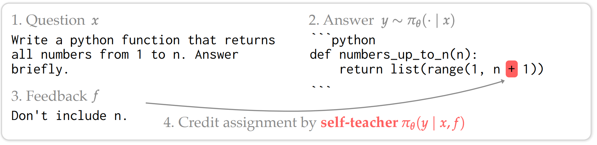
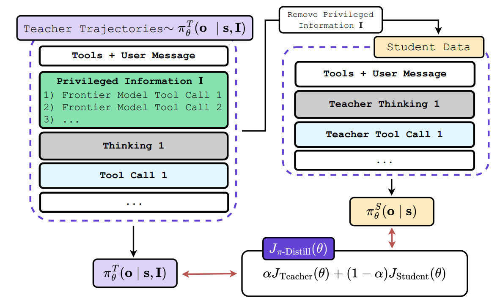
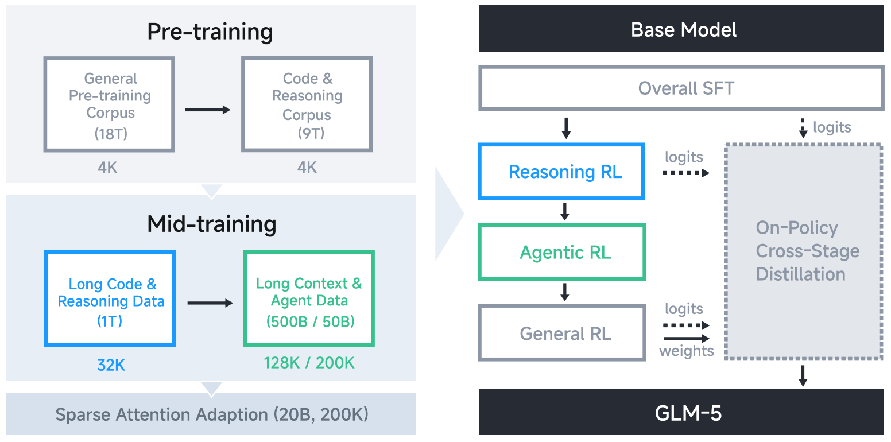
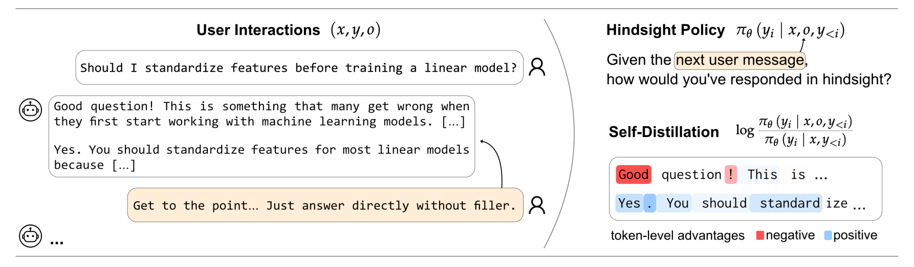

## The Case for On-Policy Self-Distillation in RL

Reinforcement Learning (RL) has become the primary engine driving complex reasoning and agentic behavior in modern language models. However, scaling RL to handle these sophisticated, long-horizon tasks introduces a unique set of mathematical and systemic challenges.

While standard RL algorithms excel at encouraging exploration, they often encounter two notable hurdles as task complexity increases:

* **The Sparse Reward Credit Assignment Challenge:** Standard RL frequently relies on episode-level, scalar outcome signals (e.g., a "1" if a script compiles, a "0" if it fails). For long-horizon reasoning tasks, assigning credit becomes difficult. A single scalar "0" at the end of a 1,000-token trajectory provides the model with limited information about *which* specific token or decision led to the failure [5].
* **Balancing Capabilities in Sequential RL:** As models graduate from simple math problems to complex, multi-step agentic workflows, training pipelines frequently utilize cascaded or asynchronous RL. As noted in the GLM-5 technical report [4], this can introduce an "off-policy lag" that strains standard on-policy anchors. If not carefully managed, this can lead to entropy collapse or the catastrophic forgetting of foundational coding and reasoning capabilities while the model over-optimizes for the new sparse reward.

To address these instabilities, one might instinctively look to standard distillation (training on external, fixed datasets). However, off-policy distillation can introduce exposure bias and distribution shift [2]. Finding a solution that remains on-policy---generated entirely within the student model's own probability manifold---offers a much more robust path forward. This brings us to the value of **On-Policy Self-Distillation**, a paradigm that reimagines the role of the Reference Model in the RL pipeline.

To maintain stability, modern RL frameworks like GRPO [7] apply a KL-divergence penalty against a **static, historical checkpoint**. This acts as a helpful *defensive* anchor. It penalizes the model for drifting too far from its past self, but it does not necessarily provide constructive guidance on *how* to navigate the reasoning space to achieve the reward.

On-policy self-distillation, formalized in frameworks like Generalized Knowledge Distillation (GKD) [2], evolves this mechanism. Instead of a static historical anchor, it uses a **dynamic, context-conditioned version of the model itself** as an active teacher. This shift from a defensive anchor to a constructive self-teacher provides two key structural benefits:

1. **Converting Sparse Outcomes to Dense Signals:** By mathematically minimizing the divergence (e.g., Generalized JSD or Reverse KL) between the student's logits and the dynamic teacher's logits at every single step, self-distillation helps translate delayed, episode-level outcomes into immediate, token-level dense rewards.
2. **Seamless Integration of Hindsight Feedback:** It provides a mathematically sound avenue to utilize environmental verifiers. By feeding hindsight feedback (like a compiler error) directly to the dynamic teacher, the teacher can generate an optimal, corrected reasoning path. The student then internalizes this complex reasoning token-by-token, effectively bridging the gap between exploration and exploitation.

## Core Math Formulation: Bridging RL and Distillation

To ground the conceptual benefits of on-policy self-distillation, it is helpful to examine the mathematical bridge between standard reinforcement learning and knowledge distillation. By aligning their underlying objective functions, we can see exactly how distillation naturally provides the dense signals that complex RL tasks require, and how in-context learning eliminates the need for an external reward model.

### The Basic Equivalence: RL and On-Policy Distillation

Standard knowledge distillation relies on fixed, offline datasets, which often leads to a train-inference distribution mismatch (exposure bias). The GKD framework [2] addresses this by shifting from fixed datasets to student-generated trajectories.

Instead of evaluating over a static dataset, the on-policy distillation objective samples output sequences $y$ directly from the student's current policy $p_S$:

$$
L_{OD}(\theta) = \mathbb{E}_{x \sim X} \big[ \mathbb{E}_{y \sim p_S(\cdot|x)} [\mathcal{D}_{KL}(p_T \| p_S^\theta)(y|x)] \big]
$$ {#eq-on-policy-distillation}

The critical architectural detail here is the **stop-gradient**. Do not backpropagate through the student's sampling distribution $p_S(\cdot|x)$. By making this mathematical choice, the training structurally mirrors a standard RL policy gradient (like REINFORCE). The divergence $\mathcal{D}_{KL}$ no longer acts purely as a supervised loss; it acts as a dense, token-level *reward* evaluating the student's explored trajectory against the teacher.

Because of this structural equivalence, on-policy distillation can be seamlessly merged with explicit RL fine-tuning (like RLHF or RLAIF). The combined objective simply balances the explicit scalar environment reward $r(y)$ with the distillation divergence:

$$
\mathbb{E}_{x \sim X} \big[ (1-\alpha) \mathbb{E}_{y \sim p_S^\theta}[r(y)] - \alpha \mathbb{E}_{y \sim p_S}[\mathcal{D}(p_T \| p_S^\theta)] \big]
$$ {#eq-combined-objective}

This demonstrates that distillation and RL are fundamentally compatible forces. Distillation simply provides the granular, token-level guidance that sparse RL lacks.

### The Contextual Leap: Self-Distillation as Inverse RL

The equivalence becomes even more powerful when we remove the need for an external reward $r(y)$ entirely. By conditioning the teacher on privileged context $c$ (such as a demonstration or hindsight feedback), we can mathematically prove that self-distillation *is* an Inverse RL algorithm.

The analysis in Self-Distillation Enables Continual Learning [1] provides the formal derivation for this. First, we define the core objective: minimizing the reverse KL divergence between the student $\pi_{\theta}$ and the context-conditioned teacher $\pi(\cdot|x, c)$ over trajectories sampled from the student itself:

$$
\mathcal{L}(\theta) = \mathbb{E}_{y \sim \pi_{\theta}(\cdot|x)} \left[ \log \frac{\pi_{\theta}(y|x)}{\pi(y|x,c)} \right]
$$ {#eq-reverse-kl}

Because LLMs are autoregressive, we can decompose this sequence-level divergence into a token-level loss. Taking the gradient with respect to the student's parameters (while treating the teacher's distribution as fixed) yields the following estimator:

$$
\nabla_\theta \mathcal{L}(\theta) = \mathbb{E}_{y \sim \pi_\theta} \bigg[ \sum_t \sum_{y_t} \log \frac{\pi_\theta(y_t|y_{<t},x)}{\pi(y_t|y_{<t},x,c)} \nabla_\theta \log \pi_\theta(y_t|y_{<t},x) \bigg]
$$ {#eq-distillation-gradient}


To map this to RL, we introduce the "In-Context Assumption." In standard trust-region RL, the optimal policy $\pi^*$ is unknown. However, we can assume that the model, when conditioned on an expert demonstration, approximates this optimal policy: $\pi^*(y|x) \approx \pi(y|x,c)$.

Using this assumption, we can define an intrinsic reward function representing the gap between the optimal policy and the current policy $\pi_k$:

$$
r(y,x,c) = \log \pi(y|x,c) - \log \pi_k(y|x)
$$ {#eq-intrinsic-reward}

If we plug this intrinsic reward into the standard RL policy gradient ($\nabla_\theta J(\pi_k)$) to maximize the expected reward, we get:

$$
\nabla_\theta J(\pi_k) = \mathbb{E}_{y \sim \pi_k} \bigg[ \log \frac{\pi(y|x,c)}{\pi_k(y|x)} \nabla_\theta \log \pi_k(y|x) \bigg]
$$ {#eq-rl-gradient}

Comparing the two gradients reveals the synthesis: the distillation gradient and the RL policy gradient are mathematically equivalent in expectation.

This derivation proves that applying a distillation loss against a context-conditioned teacher is identical to applying an RL policy gradient that maximizes an intrinsic reward. Self-distillation is, quite literally, an on-policy RL algorithm driven by the model's own in-context reasoning.

## How to Distill in RL: Algorithmic Implementations

We have established the mathematical equivalence between RL and on-policy self-distillation. However, standard RL algorithms (like PPO or GRPO) rely on a delayed, sequence-level scalar (the environment reward) to calculate an Advantage, whereas self-distillation intrinsically provides a dense, token-level signal.

The practical engineering challenge is determining exactly *how* to condition the teacher and *where* to inject this dense signal into the RL pipeline. Modern post-training frameworks generally adopt one of three distinct approaches.

### Approach 1: Hindsight-Conditioned Advantage Replacement (SDPO)

The most direct application is to completely discard the sparse environment reward. Frameworks like **Self-Distillation Policy Optimization (SDPO) [5]** are built as a direct, drop-in upgrade for GRPO. Instead of calculating a standard group-relative scalar advantage (e.g., $A_i = R_i - \text{mean}(R)$) that applies uniformly to every token in a sequence, SDPO replaces the GRPO advantage with the token-level logit gap.

*The Context/Teacher:* The self-teacher is dynamically conditioned on **hindsight feedback** (such as compiler errors, unit test failures, or environment output).

*The Math:* By looking at the feedback, the teacher generates an optimal corrected distribution. The advantage for a specific token $y_t$ becomes:

$$
A_{\text{SDPO}}(y_t) = \log \pi_{\text{teacher}}(y_t | x, \text{feedback}) - \log \pi_{\text{student}}(y_t | x_{<t})
$$ {#eq-sdpo-advantage}

This fundamentally solves the GRPO credit assignment bottleneck. If a student correctly generated a standard for-loop before making a logic error later, the for-loop tokens still receive a positive advantage because the teacher (seeing the error) also generated them.



*Figure 1: Dense credit assignment in SDPO. By comparing the student's next-token distribution to the self-teacher's feedback-conditioned distribution, SDPO assigns positive or negative (red) advantages token-by-token. This allows the model to correctly attribute credit to successful early steps while penalizing the specific tokens that led to the runtime error. (Source: Hübotter et al., 2026)*

### Approach 2: Privileged-Information Reward Augmentation (OPSD)

Unlike the total replacement in Approach 1, **On-Policy Self-Distillation (OPSD)**---a term coined concurrently by Zhao et al. [8] for mathematical reasoning and by Penaloza et al. [3] for agentic workflows---keeps the standard RL advantage calculation fully intact but shapes the underlying environment reward itself. This section focuses on the Penaloza et al. formulation, which is a direct implementation of the hybrid RL-Distillation objective theorized in GKD.

*The Context/Teacher:* The teacher is conditioned on **Privileged Information (PI)**---such as ground-truth tool calls, expert reasoning traces, or hints---that are explicitly hidden from the student during its rollout.

*The Math:* The objective seamlessly merges the explicit external reward with the implicit teacher reward using a dense shaping penalty:

$$
R_{\text{total}} = R_{\text{env}} - \beta \cdot D_{KL}[\pi_{\text{student}} \| \pi_{\text{teacher}}]
$$ {#eq-opsd-reward}

In a complex task, the sparse environment reward $R_{\text{env}}$ is only non-zero at the final step. However, the reverse KL term provides a non-zero shaping reward at *every single step*, guiding the standard RL algorithm toward the correct reasoning path step-by-step.



*Figure 2: Information asymmetry in On-Policy Self-Distillation (OPSD). The teacher model is conditioned on privileged context (such as ground-truth tool calls) that is hidden from the student. This allows the teacher to generate a dense shaping reward that guides the student's exploration step-by-step. (Source: Penaloza et al., 2026)*

### Approach 3: Cross-Stage Distillation for Stability (GLM-5)

As models scale to long-horizon agentic workflows, training pipelines must rely on sequential or cascaded RL stages. In these environments, self-distillation is utilized not to teach a new task, but as a defensive anchor to prevent catastrophic forgetting.

*The Context/Teacher:* Unlike SDPO or OPSD, the teacher here is **not** conditioned on extra textual context. Instead, **GLM-5 [4]** performs "Cross-Stage Distillation," where the teacher is strictly defined as the final, optimized model checkpoint from the previous RL stage (e.g., using the Reasoning RL expert to teach the Agentic RL student).

*The Math:* GLM-5 uses the exact same mathematical mechanism as SDPO, replacing the standard GRPO advantage with the stop-gradient logit gap:

$$
\hat{A}_{i,t} = \text{sg}\left[\log \frac{\pi_{\text{teacher}}(y_{i,t} | x, y_{i,<t})}{\pi_{\text{student}}(y_{i,t} | x, y_{i,<t})}\right]
$$ {#eq-glm5-advantage}

Because the teacher is the expert from the previous stage, this advantage mathematically anchors the model. It forces the student to simultaneously match the token distribution of its past, highly capable self, guaranteeing that the model does not "unlearn" its core coding or mathematical reasoning abilities while aggressively exploring new agentic strategies.



*Figure 3: Cross-Stage Distillation in the GLM-5 pipeline. The optimized reasoning model serves as a defensive anchor while the student explores agentic environments, preventing catastrophic forgetting. (Source: GLM-5 Technical Report)*

## What to Distill in RL: The Two Recipes

The algorithmic mechanics described in the previous section reveal that self-distillation can easily be injected into an RL pipeline. However, the true power of this framework lies in application: *who* you select as the Teacher dictates *what* problem you are solving.

In modern post-training pipelines, engineers generally deploy self-distillation to solve one of two distinct challenges: combining the strengths of specialized models (Multi-Expert Distillation), or bootstrapping the model to learn entirely new reasoning paths using information asymmetries (Context-Conditioned Distillation).

### Recipe A: Multi-Expert Distillation

* **The Problem:** Training a single model to master distinct, complex domains (like math and long-horizon agentic workflows) simultaneously in a single RL run is highly unstable.
* **The Solution:** Technically, engineers can train multiple teachers with RL in parallel---each becoming the absolute best at a specific task---and then distill their specialized distributions into a final, unified model.
* **The Application (GLM-5):** To survive the transition to agentic engineering, the **GLM-5 [4]** pipeline utilizes *Cross-Stage Distillation*. When training the Agentic RL stage, the engineers set the "Teacher" as the final, optimized checkpoint from the prior Reasoning RL stage. This consolidates the capabilities of both experts into the final model, allowing the agent to explore new environments without experiencing catastrophic forgetting of its foundational math and coding skills.

### Recipe B: Context-Conditioned Distillation

* **The Problem:** Standard sparse rewards (e.g., a "0" for failing a task) do not provide the model with any constructive information on *how* to solve a complex task it currently fails at. Without massive, expensive datasets of human-written Chain-of-Thought (CoT) to demonstrate the correct path, the model's exploration is severely bottlenecked.
* **The Solution:** The teacher is defined as the current model itself, but dynamically conditioned on rich *context* that provides useful information the student is not allowed to see.
* **The Application (SDPO & OPSD):** This recipe relies on information asymmetry to create a "Self-Teacher."
    * **Hindsight Feedback:** In **SDPO [5]**, when a student model attempts a coding task and fails, the environment returns a compiler error. This textual error is fed directly into the prompt of the Self-Teacher. Conditioned on this hindsight feedback, the Teacher naturally recognizes the mistake and generates a corrected CoT trajectory. The student then distills this dynamically generated correction.
    * **Privileged Information:** In **OPSD [3]**, the task might be a complex multi-step agentic workflow. The Teacher is provided with "Privileged Information" (such as ground-truth tool calls or expert hints) that are hidden from the student. The Teacher executes the optimal path, and the reverse-KL penalty densely guides the student's exploration toward that successful behavior.
    * **User Interactions:** This recipe extends beyond coding and agents. As demonstrated in *Aligning Language Models from User Interactions* **[6]**, the context can simply be human conversational corrections (e.g., "Make this more polite" or "You forgot to mention X"). By feeding these critiques to the Teacher, the model generates its own dense alignment signals, effectively replacing standard, fragile RLHF reward models.



*Figure 4: Aligning language models directly from user interactions. By treating natural human conversational corrections (e.g., "Make this more polite") as privileged context for the self-teacher, the model generates its own dense alignment signals on the fly, entirely bypassing the need for fragile external Reward Models or offline human labeling. (Source: ETH Zurich LAS Group, 2026)*

### Summary: On-Policy Self-Distillation Recipes

```{=html}
<div class="column-page wide-comparison-table">
<table>
<thead>
<tr>
<th style="width:14%">Strategy</th>
<th style="width:24%">The Core Concept</th>
<th style="width:20%">Who is the Teacher?</th>
<th style="width:12%">Mechanism</th>
<th style="width:30%">Examples</th>
</tr>
</thead>
<tbody>
<tr>
<td><strong>A: Multi-Expert Distillation</strong></td>
<td><strong>Skill Consolidation:</strong> Instead of forcing a single RL pipeline to learn everything at once, train multiple specialized models and distill them into a final unified policy.</td>
<td><strong>Multiple Specialized Checkpoints:</strong> Each model is the best at a specific task (math expert, coding expert, agentic expert).</td>
<td>Cross-Stage / Expert Distillation</td>
<td><strong>GLM-5 [4]:</strong> The Agentic RL stage uses the optimized checkpoint from the prior <em>Reasoning</em> stage as teacher, consolidating both experts without catastrophic forgetting.</td>
</tr>
<tr>
<td><strong>B: Context-Conditioned Distillation</strong></td>
<td><strong>The Exploration Bottleneck:</strong> Sparse rewards (pass/fail) don't teach a model <em>how</em> to correct its mistakes. The solution: provide the right context to generate dense signals.</td>
<td><strong>The Current Model (Contextualized):</strong> The model itself, conditioned on rich <em>context</em> hidden from the student.</td>
<td>Information Asymmetry</td>
<td>
<strong>SDPO [5]:</strong> <em>Hindsight feedback</em> (compiler errors) to correct code.<br><br>
<strong>OPSD [3]:</strong> <em>Privileged information</em> (ground-truth tool calls) to guide agentic exploration.<br><br>
<strong>User Int. [6]:</strong> <em>Human conversational critiques</em> to self-align behavior.
</td>
</tr>
</tbody>
</table>
<p><em>Table 1: A comparison of the two primary on-policy self-distillation recipes for RL post-training.</em></p>
</div>
```

## Conclusion: Expanding the Post-Training Toolkit with Self-Distillation

As the post-training stack continues to evolve, on-policy self-distillation has emerged as a highly promising mechanism for addressing some of the most persistent challenges in reinforcement learning. Rather than representing a complete departure from existing methods, it offers a powerful, complementary tool for modern AI engineering.

**Addressing the Agentic Bottleneck**

As models increasingly tackle complex, long-horizon agentic workflows---such as multi-step tool use, web browsing, or software engineering---relying solely on sparse scalar rewards (e.g., a simple pass/fail at the end of a long task) creates a significant credit-assignment hurdle. To optimize effectively in these dynamic environments, models benefit greatly from dense, token-level feedback to understand exactly which specific decisions or logic steps led to a failure.

**The Potential of the "Self-Teacher"**

Historically, obtaining these dense learning signals required maintaining separate, complex Reward Models (RMs) or distilling from a much stronger, larger model. Both approaches can be expensive, fragile, or impractical---especially when training frontier models where a "stronger" teacher does not yet exist. Self-distillation offers a compelling alternative. It leverages the model's own innate in-context learning capabilities to translate rich environment feedback (like compiler errors, execution traces, or human critiques) into a structured, dense gradient signal, effectively allowing the model to act as its own teacher.

**A Complementary Enhancement**

Ultimately, on-policy self-distillation is not meant to replace the existing RL stack. Instead, as demonstrated by algorithmic implementations like SDPO and OPSD, it serves as a highly practical enhancement for standard policy optimization algorithms like GRPO. By converting rich hindsight or privileged context into token-level advantages, self-distillation helps mitigate the credit assignment challenge while preserving the vital exploratory benefits of reinforcement learning. As models push further into the agentic era, frameworks that seamlessly blend the exploration of RL with the dense guidance of distillation are likely to become an increasingly standard part of the training toolkit.

## References {.unnumbered}

::: {.references-list}
1.  Shenfeld, I. et al. (2026). *Self-Distillation Enables Continual Learning.* [arXiv:2601.19897](https://arxiv.org/abs/2601.19897)
2.  Agarwal, R. et al. (2023). *On-Policy Distillation of Language Models: Learning from Self-Generated Mistakes.* [arXiv:2306.13649](https://arxiv.org/abs/2306.13649)
3.  Penaloza, E. et al. (2026). *Privileged Information Distillation for Language Models.* [arXiv:2602.04942](https://arxiv.org/abs/2602.04942)
4.  GLM Team (2026). *GLM-5: from Vibe Coding to Agentic Engineering.* [arXiv:2602.15763](https://arxiv.org/abs/2602.15763)
5.  Hübotter, J. et al. (2026). *Reinforcement Learning via Self-Distillation.* [arXiv:2601.20802](https://arxiv.org/abs/2601.20802)
6.  ETH Zurich LAS Group (2026). *Aligning Language Models from User Interactions.* [self-distillation.github.io](https://self-distillation.github.io/user_interactions.pdf)
7.  Ye, T. et al. (2024). *DeepSeekMath: Pushing the Limits of Mathematical Reasoning in Open Language Models.* [arXiv:2402.03300](https://arxiv.org/abs/2402.03300)
8.  Zhao, Y. et al. (2026). *Self-Distilled Reasoner: On-Policy Self-Distillation for Large Language Models.* [arXiv:2601.18734](https://arxiv.org/abs/2601.18734)
:::
