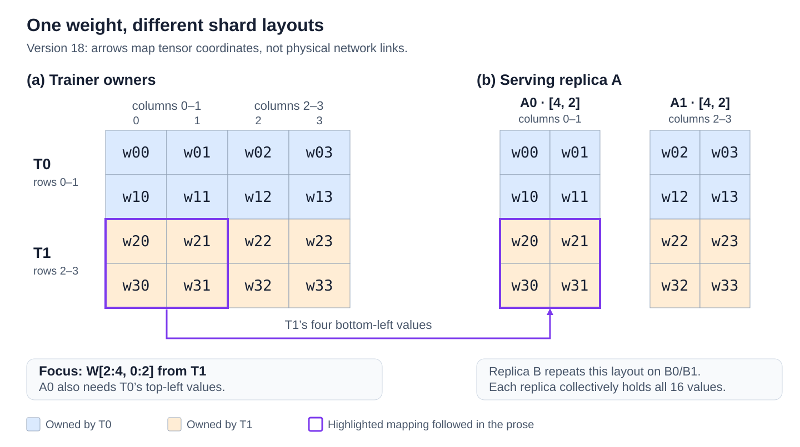
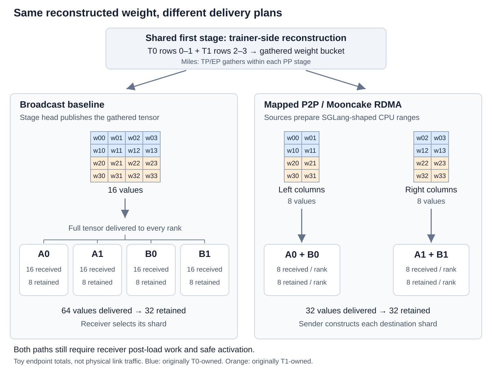
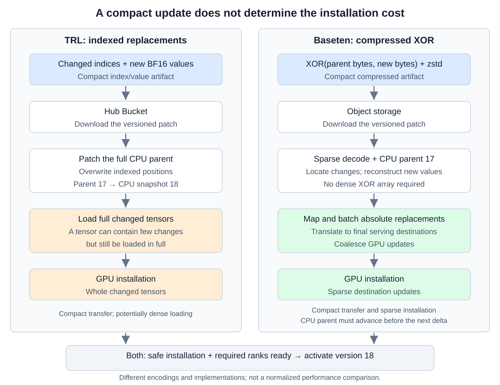
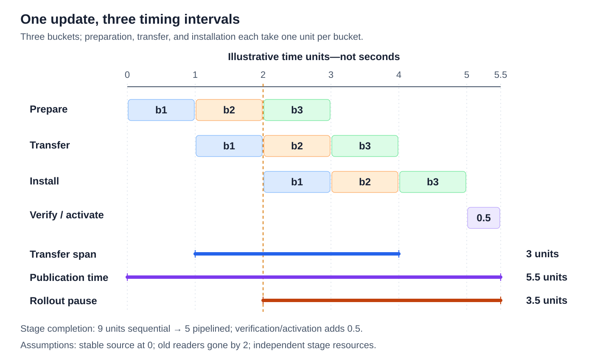

## The optimizer finished. Which policy is rollout using?

After an RL training update, we want the next round of generated responses to use the updated model. But the workers generating those responses have their own copies of the weights. How do we get the changes to them, and how long does that take?

For a large model spread across many GPUs, this handoff can become a substantial part of the training loop. Moving the weights is only part of the work: the receiving workers also need to put them into a form they can use and decide when to switch away from the previous version.

This post follows that handoff from training to generation. We'll start with a small example, use it to understand several real implementations, and examine how mapped delivery and delta updates reduce the work.

The sections build up the explanation in the following order:

- [Section 2 — Background](#background-ranks-shards-and-memory) introduces ranks, shards, replicas, memory, and communication operations. These terms let us distinguish a tensor's ownership from the physical path used to deliver it.
- [Section 3 — Ownership mapping](#which-part-of-the-weight-does-each-rollout-rank-need) works through a small weight split differently by trainer and rollout. It establishes exactly which values each serving rank needs, before we choose a delivery mechanism.
- [Section 4 — Broadcast to mapped P2P](#from-trainer-storage-to-serving-storage) follows Miles' NCCL broadcast baseline, the destination-aware replacement, and the preparation and buffer-lifetime trade-offs. A colocated adapter update provides a smaller supporting case.
- [Section 5 — Delta updates](#how-much-of-the-exported-weight-actually-changed) follows TRL's indexed patches and Baseten's sparse decoding and GPU installation, then connects compact updates to Fireworks' multi-cluster setting.
- [Section 6 — Safe policy switching](#when-may-generation-use-the-new-version) continues from received values to a usable policy: safe installation, requests carrying old model state, readiness across participating ranks, and checks that the live kernels use the new weights.
- [Section 7 — End-to-end performance](#what-does-faster-weight-synchronization-measure) measures the complete path. A bucketed pipeline separates transfer time, rollout pause, and the full handoff time, then connects those intervals to the RL cycle and the age of the policy used for generation.

## Background: ranks, shards, and memory

Before following the updated weights, we need a few terms for who holds each part of a model and where those parts live. This background covers ranks, shards, and replicas; GPU and host memory; communication operations; and the distinction between metadata and weight bytes. These are the ingredients for the ownership example in Section 3 and the delivery paths in Section 4.

### Processes, shards, and replicas

A model's weights are stored in tensors. A shard is part of a tensor, while a rank is a participant in a distributed job, usually represented by a process. A rank often runs on one GPU, but its rank number identifies a communication participant, not a physical device or tensor coordinate.

A rollout replica is a complete independently usable serving copy of the model. It can span several ranks whose shards collectively supply the weights needed for inference. A rank holding half a weight is not another full model replica.

Tensor parallelism (TP) splits computations and tensors within layers; pipeline parallelism (PP) assigns different layers to different stages. Expert parallelism (EP) distributes the experts of a mixture-of-experts (MoE) model. Data parallelism (DP) processes different samples in parallel, conventionally with replicated model weights [[13]][source-13]. Fully sharded data parallelism (FSDP) also shards parameters, gradients, and optimizer state across its workers, gathering parameters when needed for computation [[14]][source-14]. These strategies can be combined, and the trainer and serving engine can use different combinations.

### GPU memory, host RAM, and NICs

A host, or node, is one machine. Its CPU-addressable host RAM is separate from the GPU's device memory, often called HBM (high-bandwidth memory). Trainer parameters, serving weights, and temporary buffers can occupy different allocations on these devices. A NIC is the network interface through which the host sends and receives network traffic.

Trainer and rollout processes may share a GPU, use different GPUs within one host, or run on separate hosts. One possible cross-host route copies weights from GPU memory to host RAM, sends them over the network, then copies them into the receiver's GPU memory. Other supported paths share allocations or avoid host staging. Placement determines the available paths; it does not determine which tensor entries the receiver needs.

### Communication operations and hardware paths

A process group is the set of ranks participating in a communication operation. All-gather collects their pieces and gives every participant the assembled result, without summing values. All-reduce combines corresponding entries, for example by summing gradient contributions, and gives every participant the result. Broadcast distributes one source's existing tensor to the group [[2]][source-2].

These operations describe what participants receive. NCCL is a library implementing collectives and peer send/receive operations over supported local or network paths. NVLink, PCIe, and network interconnects provide the underlying connectivity [[15]][source-15]. Naming an all-gather alone therefore does not specify whether bytes cross a host boundary.

### Metadata, payloads, and temporary buffers

An update carries metadata—tensor names, shapes, versions, and locations—as well as the actual weight values. A message containing a memory handle tells the receiver how to access an allocation; it need not contain or copy the tensor bytes. CUDA IPC uses such a handle to expose GPU memory to another local process [[5]][source-5].

A transfer bucket packages ranges from one or more tensors in a buffer. Its boundaries need not match a model shard or a complete serving tensor. The receiver may use temporary staging before installing values in the storage its kernels read. Because copies and GPU work can be asynchronous, an API return may precede their completion. The source must remain allocated and unchanged until the operations reading it have finished.

## Which part of the weight does each rollout rank need?

A rollout rank needs eight weight values, and a trainer rank has an eight-value shard ready to send. That sounds like a straightforward copy. But if the trainer owns two rows of a matrix while rollout needs two columns, copying the shard into the serving tensor would fill it with the wrong values.

The first task is to work out which values belong in each serving tensor. A small example will let us trace that mapping, see which metadata has to travel with the values, and compare the payload under two delivery plans. Section 4 then follows these same values through the memory and communication paths.

Throughout the example, version 17 is the policy installed in rollout and version 18 is the updated policy on the trainer.

Consider one logical $4\times4$ weight $W_{18}$ from the updated policy. Here, 18 identifies the policy version. Element labels such as $w_{20}$ identify coordinates—row 2, column 0—not numerical values.

The trainer has two owners: T0 stores rows 0–1, and T1 stores rows 2–3.

Assume two complete rollout replicas, A and B. Replica A is split across A0 and A1; replica B repeats the same layout across B0 and B1. Each replica collectively stores all 16 elements.

Rollout partitions the weight by columns: A0 and B0 need columns 0–1, while A1 and B1 need columns 2–3.

::: {.column-page}

<a class="diagram-link" href="images/ownership-map.svg" target="_blank" rel="noopener" aria-label="Open Figure 1 at full size"></a>

*Figure 1: One logical weight, two trainer owners, and two complete rollout replicas. The trainer row shards must be mapped into serving column shards. A0 requires contributions from both T0 and T1; A1 requires the complementary contributions. A simplified example of different training and serving layouts.*

:::

Focus on A0. Sending T1's entire $2\times4$ row shard would give A0 columns it does not need and still leave it missing T0's rows. Its correct local tensor is

$$
W_{A0,18}
=\operatorname{concat}_{\mathrm{rows}}\!\left(
W_{T0,18}[:,0{:}2],
W_{T1,18}[:,0{:}2]
\right).
$$

This is assembly of different coordinates. An all-reduce would instead combine contributions to the same coordinates, such as gradients computed on different data-parallel workers. Summing T0's rows with T1's rows would not reconstruct A0's weight.

One implementation could first all-gather the trainer shards, giving its exporters a complete tensor, then select the columns for each destination. Another could route the required slices directly. Either way, T1's bottom-left values must end up in A0's bottom rows. All-gather reconstructs the disjoint pieces; broadcast delivers an already assembled tensor to a group [[2]][source-2].

### From coordinates to a transfer plan

For the bottom half of A0, the semantic mapping is

```text
version: 18
source: T1 / W[2:4, 0:2]
destination: replica A / rank A0 / local W[2:4, :]
contents: w20, w21, w30, w31
```

A correct coordinate map also needs a consistent source snapshot. The trainer can continue training while the weights are being prepared and delivered if version 18 has a stable snapshot or protected export storage. Without that protection, A0 could assemble T0's version-18 values with T1's version-19 values under a version-18 label. It would contain the expected coordinates but could represent a weight that never existed on the trainer.

A transfer plan adds source allocations, byte offsets, destination addresses, and operations. If T1 stores its row shard in row-major order, the two left-column pairs are separated by the right-column values. Packing the four required values into a contiguous buffer can make them easier to transfer.

A0 needs the tensor name, shape, coordinates, version, and representation alongside the payload. Four values from T1's right columns would have the expected length but fill A0 with the wrong part of the weight.

These identifiers recur across full weights, adapters, and deltas: the target policy version, type of update, destination layout, and numerical representation. An adapter also identifies its frozen base; a delta identifies the exact parent it reconstructs from. Checksums can help verify received bytes, but Section 6 returns to the separate question of whether the live serving kernels use them.

A real model may also fuse separate query, key, and value projections into one tensor, reorder experts, or select the experts owned by a serving rank. Quantized weights add packed codes, scales, and auxiliary metadata: the codes store low-precision values, while scales supply the magnitude factors used to interpret them. The export map has to describe where these objects belong in the tensors read by the serving kernels.

### What is stored, what is delivered, and what crosses the network

The ownership map also lets us count the update. We need to distinguish three quantities:

- **Final stored state:** Each of the four serving ranks retains eight elements. Each replica holds a complete copy of the 16-element weight, so replicas A and B store 32 elements in total.
- **Endpoint payload:** A deliberately simple plan broadcasts the full 16-element matrix to every serving rank, then each rank selects its columns. It delivers $4\times16=64$ elements to the receivers. Mapped delivery sends only each rank's required eight-element shard, for $4\times8=32$ elements. These counts include all values delivered to the ranks, even those they later discard.
- **Network traffic:** This cannot be inferred from endpoint payload alone. It depends on where the ranks run and how the update is distributed. One cross-host transfer followed by local distribution has different network traffic from separate cross-host transfers to every rank. A local CUDA IPC handoff may need no network transfer, although reading or copying the values still uses local memory or GPU interconnects.

Mapped delivery halves the endpoint payload in this example, but it does not necessarily halve network traffic. That depends on where the ranks run and how the update is distributed.

For BF16, the final stored state across the two replicas is 64 bytes. The full-matrix delivery plan has an endpoint payload of 128 bytes; mapped delivery has an endpoint payload of 64 bytes.

For MoE, count attention, routed experts, shared experts, and routers according to their actual ownership and replication. Some tensor families are replicated where others are sharded. Start by identifying complete serving replicas, then map each family's destinations; GPU count or total parameters divided by TP can hide those differences.

## From NCCL broadcast to mapped P2P {#from-trainer-storage-to-serving-storage}

Miles replaces its NCCL broadcast delivery stage from Megatron to separate SGLang engines with destination-aware P2P transfers through Mooncake. The change reduces redundant delivery and distributes sending work across more trainer sources [[1]][source-1].

This is a comparison of two delivery plans, not “NCCL versus P2P” as mutually exclusive technologies. NCCL supports both collectives and point-to-point operations, and can use an RDMA-capable network [[15]][source-15], [[22]][source-22]. What changes in the Miles implementation is who prepares each destination's values, who sends them, and how the transfers are scheduled.

Here, publication means the complete handoff: securing a consistent source version, preparing and delivering its weights, installing them, and permitting generation. A fast transfer is one stage of that process.

### The baseline: gather on the trainer, then broadcast to rollout

The broadcast path first gathers bucketed TP/EP weight pieces within each trainer PP stage. Each stage exports the layers it owns; rollout does not participate in those trainer-side gathers. A head rank for the stage then broadcasts the gathered tensors over a separate update group, and each SGLang rank's loader selects its own shard [[1]][source-1].

Apply that plan to our $4\times4$ matrix. T0 and T1 initially own different rows. After reconstruction, a publisher has all 16 values. Broadcasting that tensor to A0, A1, B0, and B1 delivers 16 values to each endpoint, although each retains only eight.

The four receivers therefore receive 64 values in total and retain 32. This is endpoint accounting for the illustrated plan, not a claim that 64 values cross one source NIC: NCCL's broadcast algorithm and physical topology determine the actual link traffic.

The baseline is straightforward because each receiver can use an existing full-tensor loader. The sender need not construct a different shard for every serving rank. That convenience has a cost when the serving layout discards much of what each receiver receives.

### Why change the delivery plan?

Miles identifies three opportunities in this path [[1]][source-1]:

- Deliver each receiver's needed ranges instead of sending a full tensor for it to slice.
- Use more available trainer sources rather than concentrating delivery on the publishing head ranks.
- Schedule mapped transfers without requiring every receiver to join the same sequence of broadcast operations.

The last point is about coordination, not merely bandwidth. Participants in a collective must agree on the operations they execute; a receiver that is not ready can delay progress. Direct mapped transfers allow a different schedule, but the application must now manage destination metadata, completion, and version consistency explicitly.

Figure 2 holds the trainer gather and serving destinations fixed so that the delivery change is visible.

::: {#broadcast-versus-mapped-p2p .column-page}

<a class="diagram-link" href="images/broadcast-vs-mapped-p2p.svg" target="_blank" rel="noopener" aria-label="Open Figure 2 at full size"></a>

*Figure 2: Broadcast and mapped P2P delivery in Miles, illustrated with Figure 1's matrix. Both paths retain trainer-side reconstruction. Broadcast delivers 64 values across four endpoints; mapped delivery supplies the 32 values those endpoints retain. Arrows represent logical delivery, not physical network links or NCCL's internal broadcast algorithm.*

:::

### The P2P path: prepare the receiver's shard before sending it

Miles moves serving-layout preparation to the sender. Its CPU “replicas” on trainer hosts hold SGLang-shaped weights and reusable transfer storage; they do not generate tokens. Mooncake then transfers the prepared ranges through RDMA, and the receiving engine finishes any required GPU-specific post-processing [[1]][source-1].

For our matrix, preparation produces an eight-value left-column shard for A0/B0 and an eight-value right-column shard for A1/B1. Both contain values originally owned by T0 and T1. The initial row owner need not be the final network sender: reconstruction and source assignment precede delivery.

The implementation has two distinct phases:

1. During setup, obtain receiver layouts and registered-memory information, construct source-to-destination mappings, and assign available sources to the required ranges. Reusable registrations avoid repeating expensive setup for every update.
2. During an update, pause the receiving engines as required, gather trainer buckets, load the pieces into the corresponding CPU serving representations, and transfer completed destination ranges. After delivery, run the receiving engine's post-load processing, update its version, and resume generation.

The benefit comes from preparing exactly what the receiver needs and distributing the sending work. RDMA carries those ranges; it does not derive the shard mapping or make a partially assembled tensor valid.

#### Assembling serving tensors across buckets

Suppose `q_proj`, `k_proj`, and `v_proj` become one fused `qkv_proj` at the receiver, but their pieces arrive in different trainer buckets. Receiving the first bucket does not make that fused destination ready. The exporter must retain the pieces until it can complete the destination's layout, then send the appropriate range.

Miles discusses this cross-bucket assembly explicitly [[1]][source-1]. It is why temporary memory is not always bounded by one input bucket: completed export ranges, partial serving tensors, and in-flight transfers can coexist. Expert ordering and fusion add similar dependencies.

#### When can the sender reuse a buffer?

Suppose one temporary buffer first holds A0's left-column shard and will next hold A1's right-column shard. If the first transfer is asynchronous, rewriting the buffer too early can send a mixture of both shards. Keeping the allocation alive is not enough; its contents must remain stable until that transfer has finished reading them.

Miles' path waits where temporary storage must be reused and can leave a final transfer asynchronous when no subsequent preparation will overwrite its source [[1]][source-1]. That dependency determines which preparation and transfers can overlap.

Receiver readiness is a separate boundary. Registered memory lets the NIC access a range, but source-use completion is not a statement that the destination's serving kernels are ready. A GPU destination also needs the required completion notification and GPU memory ordering; the loader may still have expert rearrangement, derived-weight construction, or other post-processing to perform [[6]][source-6]. Section 6 follows those steps through activation.

### What improves, and what does it cost?

Mapped delivery removes the illustrated receivers' unwanted values and can use more sources. It also takes on CPU serving-model storage, layout-aware loading, partial-tensor buffering, and explicit transfer scheduling.

The trade-off appears in the report's results. One Kimi-K2 FP8 configuration drops from about 53.3 seconds with broadcast to 7.2 seconds with mapped P2P. A smaller GLM-4.7-9B-Flash configuration goes the other way: about 2.51 seconds for broadcast versus 4.23 seconds for P2P, with CPU loading costs outweighing the delivery savings. These are vendor-reported configuration-specific results, measured from the engine pause call's return to the generation-resume call—not optimizer completion to the first new-policy response [[1]][source-1].

Destination-aware delivery helps when avoided traffic and broader source participation outweigh its preparation costs. The transport alone does not determine which path is faster.

CPU preparation is not required by mapped P2P itself. fabric-lib's RL application reconstructs FSDP parameters on trainer GPUs, performs serving-format preparation there, and overlaps one-sided RDMA writes with preparation under a temporary GPU-memory budget [[3]][source-3]. That moves work and storage from host RAM onto the GPUs. It illustrates another preparation choice, not a controlled performance comparison with Miles' Megatron path.

Additional rollout replicas can also receive compatible weights from peers. TensorHub tracks versioned copies with model-parallel consistency rules; ModelExpress uses compatible serving peers for model loading [[9]][source-9], [[10]][source-10]. Those are extensions to source selection and fanout, not substitutes for constructing the correct destination representation.

### A simpler case: colocated LoRA updates

LoRA simplifies the amount of state being published, rather than defining a competing communication method. If rollout keeps the base frozen and applies the adapter separately, the trainer only needs to publish the updated factors [[16]][source-16].

The Miles/SGLang K3 Day-0 setup uses BF16 adapters alongside a frozen native-MXFP4 rollout base. The exporter still reconstructs the serving factors: for some expert adapters, it retains one shared factor and gathers the expert-dependent factor in expert order [[4]][source-4], [[12]][source-12]. Adapter-only publication removes the base from the per-update payload; it does not remove layout reconstruction.

For a colocated handoff, flattened GPU buckets can be exposed through CUDA IPC. Opening an IPC handle maps an allocation rather than copying its contents. The receiver must finish its reads or its own copy before the exporter reuses that bucket; the K3 report describes an acknowledgement and synchronization rule for releasing consumed buckets [[4]][source-4], [[5]][source-5]. Whether the unchanged base stays resident or is restored from local host storage is a separate memory-management question.

Mapped delivery removes values a destination does not need. Since each destination already holds version 17, unchanged values offer another opportunity to reduce the transfer.

## Delta updates: from sparse transfer to sparse installation {#how-much-of-the-exported-weight-actually-changed}

Mapped delivery avoids sending values to ranks that do not own them. Delta synchronization avoids sending values those ranks already have. Replicas A and B hold version 17; if most exported values remain unchanged, a patch and the correct parent can reconstruct version 18.

TRL uses indexed BF16 replacements delivered through a Hub Bucket. Baseten keeps decoding and GPU installation sparse as well. Fireworks uses compact updates to connect training and rollout in independent clusters [[7]][source-7], [[8]][source-8], [[21]][source-21].

Whether a value is unchanged depends on the exported representation, not merely the optimizer's higher-precision parameters.

### A small optimizer update can leave BF16 bits unchanged

TRL's delta-sync walkthrough points to BF16 rounding as a reason exported weights can stay unchanged [[7]][source-7]. Let $\theta_v$ denote FP32 master parameters after optimizer step $v$. For this example, define the exported weight as

$$
W_v=\operatorname{cast}_{\mathrm{BF16}}(\theta_v).
$$

Between 1 and 2, adjacent BF16 values are separated by $2^{-7}=0.0078125$. Under round-to-nearest, several successive master values can therefore export to the same stored BF16 value:

| FP32 master value | Exported BF16 value | Change in exported bits |
| :--- | :--- | :--- |
| 1.001 | 1.0000000 | Initial value |
| 1.002 | 1.0000000 | None |
| 1.003 | 1.0000000 | None |
| 1.004 | 1.0078125 | Replacement required |

*Table 1: FP32 updates crossing a BF16 rounding boundary. The master retains the updates; the exported value changes only when rounding selects the next representable value.*

A value already near a rounding boundary can change its BF16 bits after a tiny update. The learning rate alone tells us little about how many elements change; compare the actual exported bit patterns.

A patch that reconstructs $W_{18}$ exactly is lossless relative to this BF16 export. The FP32 master continues to retain its updates, including those that have not yet changed the exported bits.

### TRL: publish changed positions and their new values

An indexed patch identifies changed positions and supplies their complete new values. Conceptually, for a bit-exact BF16 export,

$$
I=\left\{i:\operatorname{bits}(W_{18}[i])
\ne\operatorname{bits}(W_{17}[i])\right\},
\qquad
P_{17\to18}=(I,W_{18}[I]).
$$

The receiver overwrites those positions and inherits every omitted position from its version-17 parent. This is replacement, not addition: the transmitted value is $W_{18}[i]$, not the numerical difference $W_{18}[i]-W_{17}[i]$.

TRL's walkthrough uses BF16 index/value artifacts in safetensors, delivered through a Hub Bucket, with periodic full anchors. Its receiver applies the patch to a CPU snapshot and then loads full changed tensors into vLLM [[7]][source-7]. The compact artifact reduces network and storage movement, but a tensor with a handful of changes can still pass through the full-tensor loading path.

Sparse transfer therefore does not necessarily reduce GPU installation work. TRL reloads full changed tensors; Baseten, discussed below, applies changes at finer granularity.

#### Map two changes through the same weight

Return to Figure 1. Suppose only $w_{1,3}$ and $w_{2,0}$ change from version 17 to 18.

T0 owns $w_{1,3}$. It belongs to the right-column serving shard, so A1 and B1 need its replacement. In their $4\times2$ row-major local tensors, its flat position is

$$
j=2(1)+(3-2)=3.
$$

T1 owns $w_{2,0}$. It belongs to A0 and B0, at local position

$$
j=2(2)+0=4.
$$

```text
T0 -> A1 and B1: local offset 3, absolute version-18 value of w13
T1 -> A0 and B0: local offset 4, absolute version-18 value of w20
```

The patch supplies four replacement values across the two replicas instead of the 32 values in a complete mapped update. With a four-byte index and two-byte BF16 value, that is 24 payload bytes versus 64 dense bytes, before headers, compression, and physical hops. Eight times fewer values becomes only about 2.7 times fewer raw bytes in this tiny example because indices also cost space.

More generally, with $N$ exported BF16 elements and changed fraction $f$,

$$
B_{\mathrm{dense}}=2N,
\qquad
B_{\mathrm{patch}}\approx(4+2)fN,
\qquad
\frac{B_{\mathrm{patch}}}{B_{\mathrm{dense}}}\approx3f.
$$

At an illustrative $f=1\%$, this encoding is about 3% of dense size before additional metadata or compression. Wider indices increase that fraction; compressed indices or runs can reduce it. This estimates one export's payload, before accounting for replica fanout and physical placement.

For a fused expert tensor, compute receiver-local offsets using its permutations, padding, and packing. The change at a global coordinate has to be translated into the final serving layout before it can be applied there.

### Baseten: keep the update sparse through decoding and installation

#### Encode byte changes, then avoid reconstructing the zero regions

Baseten uses a different encoding: bytewise XOR followed by compression. Let $B_v$ be the serialized bytes of the exported version:

$$
D_{17\to18}=B_{17}\oplus B_{18},
\qquad
B_{18}=B_{17}\oplus D_{17\to18}.
$$

Unchanged bytes produce zeros. The logical XOR array still has the full serialized length, but long zero regions can compress well. Baseten reports a fixture with 716.56 GiB of logical weights represented by a 1.55 GiB compressed update; that is evidence about its tested fixture, not a guaranteed compression ratio for RL updates [[8]][source-8].

A conventional receiver could decompress the entire XOR array, XOR it with the entire parent, and reload the resulting tensors. The downloaded artifact would be small, yet decoding, scanning, allocation, and installation could still touch hundreds of GiB.

Baseten instead implements sparse decoding of the compressed XOR stream. Zero regions advance the logical output position without requiring a full dense output allocation. The decoder still has to respect the compression format's history and match-copy semantics, including matches containing nonzero bytes; “skip zeros” alone is not a correct decompressor [[8]][source-8].

The output is a compact description of changed positions. The receiver combines those changes with its CPU parent to obtain absolute replacement values. An XOR byte mask is useful for reconstructing a value; it is not itself the BF16 value that a GPU weight slot should receive.

#### Convert changes into final GPU destinations

The reconstructed changes still use exported tensor coordinates. Serving may fuse projections, permute experts, slice TP shards, or store a tensor in a different layout. The receiver translates each change into its final GPU destination and groups the resulting writes. Otherwise, millions of small changes can turn into millions of tiny copy operations.

The ownership mapping in Figure 1 also applies to delta updates. The change to $w_{2,0}$ still belongs at local offset 4 in A0 and B0. A real loader additionally accounts for its actual tensor layout and groups nearby or compatible destinations for installation.

Figure 3 contrasts the documented TRL and Baseten paths. They use different patch encodings; the comparison is about the work performed after a compact update arrives, not identical artifacts sent through two interchangeable loaders.

::: {#delta-transfer-and-installation .column-page}

<a class="diagram-link" href="images/delta-sync-installation.svg" target="_blank" rel="noopener" aria-label="Open Figure 3 at full size"></a>

*Figure 3: A compact transfer can lead to different amounts of receiver work. TRL reconstructs the CPU snapshot and loads full changed tensors. Baseten avoids dense XOR materialization and maps reconstructed changes into batched GPU updates. Both depend on the correct parent and a safe serving transition. The paths use different encodings and are not a controlled performance comparison.*

:::

Baseten reports reducing pause/load/resume from roughly 12 seconds to six seconds on one 8×B300 replica. The old policy can continue serving while download and CPU preparation occur; only the safe installation and transition need fall inside the rollout pause. Its broader marker-in-S3 to first-new-policy-response measurement is about 36 seconds, illustrating why the pause and complete update latency should not be conflated [[8]][source-8]. Section 7 puts these timing boundaries on a common timeline.

### The parent version is part of the method

Suppose version 17 has $(x,y)=(1,1)$. The patch to 18 replaces $x$ with 2. The patch from 18 to 19 replaces $y$ with 2.

Applying only the second patch to version 17 yields $(1,2)$, not version 19's $(2,2)$. Every omitted entry inherited from the parent matters, even though the transmitted values are absolute replacements.

Repeated absolute overwrites are safe for a fixed target version. Applying XOR twice undoes the patch. Both need version gating: a delayed old absolute patch can corrupt a newer committed version just as surely as an incorrect XOR parent can.

Recovery can load a complete anchor and replay an ordered patch chain, or use a patch built against the receiver's actual parent. Periodic anchors are one way to bound replay and give late-joining receivers a starting point.

Baseten advances its CPU parent in the background after the new GPU weights become active [[8]][source-8]. If serving has switched to 18 while that parent is still at 17, the receiver must finish advancing it before decoding a delta built against 18.

### Fireworks: delta updates across clusters

Mapped RDMA delivery is attractive when trainer and rollout have a suitable fabric. Independent clusters may instead share ordinary network connectivity and object storage. Fireworks describes periodic full checkpoints plus compressed deltas for transferring policy updates across such deployments [[21]][source-21]; its rollout interface separates uploading weights from synchronizing the serving deployment [[11]][source-11].

The trainer can publish completed versioned objects once, and rollout clusters can download and install them independently. Compact updates reduce the bytes on the upload and download legs, while full anchors provide a starting point for new or recovering receivers. Storage-mediated publication also decouples the trainer's export-buffer lifetime from every receiver's installation schedule.

Fireworks describes the storage-mediated update architecture but does not disclose enough detail to compare its delta codec or GPU installation path with Baseten's.

There are still costs that a compact delta does not eliminate. Export may gather all parameters, construct a complete representation, compare old and new tensors, or retain a full CPU parent. For quantized serving, a changed block scale can alter the interpretation of all codes in its group; sparse BF16 changes need not remain sparse after requantization. Patch the complete serving representation, or account for the conversion that regenerates matching codes, scales, and derived metadata.

The same question can be asked of a LoRA adapter, but the frozen base is already excluded from its update. Measure the adapter's own changed fraction and export/install costs instead of importing full-model sparsity numbers.

Mapped delivery and delta updates reduce transfer and installation work. Serving can switch to the new policy only after the required weights are installed and active requests are handled safely.

## When can rollout safely use the new weights? {#when-may-generation-use-the-new-version}

The last bucket has arrived. A0 has installed its values, A1 is still finishing post-load work, and a paused request retains state computed with version 17. When may replica A generate with version 18? Receiving all the bytes is not enough, whether they arrived as full weights, a complete adapter, or a reconstructed delta.

Before in-place writes start, active kernels must stop reading the affected weights. Switching generation also requires handling requests with older cached state, confirming that all participating ranks are ready, and verifying that the live kernels use the new weights.

### Safe installation and recovery from partial updates

When the runtime overwrites its only serving buffers, it must drain or safely pause the active requests that read them. Blocking new requests leaves already-running decode kernels using those addresses, where they could observe a partially updated tensor.

If installation fails halfway, some old values have already been destroyed. Inference may have to remain blocked until a complete reload. Rollback requires a recoverable copy of the old version.

A second set of serving buffers can retain the old version while the new one is prepared. Keeping both versions takes extra memory. Before switching, the runtime has to update or preserve any address assumptions in CUDA graphs and other captured objects so kernels read the intended version [[17]][source-17].

### What happens to active requests and their cached state?

During prefill, the model processes the input prompt and caches attention's key (K) and value (V) vectors for its tokens. During decode, it reuses this KV cache as it generates further tokens, rather than recomputing those vectors for the entire prefix.

A request that prefills under version 17 has KV entries computed with version-17 weights. A hybrid model can also have recurrent and convolution state. Continuing under version 18 with that state is generally different from executing version 18 from the beginning.

Letting a request finish before the update, or retaining the old weights and state for it, keeps it on one policy version. Switching an active request to new weights requires an explicit choice about its model-dependent state, including whether affected state is rebuilt. Reusable prefix caches also need to identify which weight version produced their entries.

Fireworks documents two hot-load choices. Its asynchronous transition pauses an active stream, swaps weights, then resumes with existing active KV/state. Its synchronous transition lets active requests finish under old weights. Resetting a reusable prompt-cache namespace does not rebuild an active stream's state [[11]][source-11].

Training and rollout can run asynchronously while each request stays on one policy version. The hot-load choice answers a different question: whether an already-running request continues after its weights change. The serving runtime has to specify that behavior separately from the trainer/rollout schedule.

### Local readiness and replica readiness

Once local installation and its checks are complete, the rank can report readiness. New-version generation waits for all ranks required by the replica, with admission following the chosen request-state policy.

Return to our two replicas. A0 and A1 have installed all their version-18 tensors. B0 is ready, while B1 is missing a scale required by one quantized weight.

Replica A has a complete version 18. B1 has the new codes but cannot execute the weight correctly without its scale, so replica B must keep waiting.

For replica A,

$$
\operatorname{ready}(A,18)
=\operatorname{ready}(A0,18)\land\operatorname{ready}(A1,18).
$$

A fleet-wide barrier waits for both A and B. With replica-local activation, the scheduler can send version-18 work to A while B waits. What B can do during that wait depends on its serving storage: if installation has overwritten its only version-17 buffers, it must remain paused until a complete version is restored or installed. If B retains a complete, usable version-17 copy, it can continue serving that copy while version 18 is prepared in separate buffers.

In the latter case, A can produce version-18 trajectories while B produces version-17 trajectories. Keep every model-parallel request on compatible ranks, and record the actual behavior version and any behavior log-probabilities used by the training objective for each trajectory. If training assumes that all responses in a rollout group share one behavior policy, route that group to compatible replicas or wait until their versions agree. Whether these samples can train together depends on the objective and how it uses their recorded behavior probabilities.

Activation is the point when the scheduler permits new-version execution, after the required memory updates and readiness checks have finished.

### Verify that generation uses the new weights

Suppose every received adapter tensor passes its checksum, but a fused kernel still reads an old slot. The next rollout uses the previous adapter despite a successful transfer.

The update metadata identifies expected names, shapes, shards, expert IDs, codes, and scales. Hashes check the received bytes. Inspecting the installed tensors and adapter bindings checks where those bytes ended up. To test whether the live kernels use them, score a fixed prefix or trajectory through the serving runtime. K3's public report combines this canary with weight-sync assertions and trainer/rollout comparisons [[4]][source-4].

An unchanged canary score is not conclusive either: a small update may barely affect that prompt. Check exported-tensor changes and optimizer steps alongside the execution probe. A BF16 trainer and low-bit rollout can also differ numerically at the same version, so compare their scores against a measured baseline.

Finally, a trajectory generated with 17 but labelled 18 gives the trainer a false account of sample age. If the loss uses the actual stored behavior log-probabilities, the label alone leaves its importance ratio unchanged. If the trainer uses the label to look up the old policy instead, it may retrieve the wrong probabilities. Recording the version and recording the behavior probabilities serve related but distinct purposes.

## Measuring synchronization end to end {#what-does-faster-weight-synchronization-measure}

Halving weight-transfer time does not necessarily halve the rollout pause. Preparation, installation, and overlap determine how soon generation can use the new policy.

Publication is complete when the serving runtime can admit generation with the new version. A transfer timer may stop earlier, while installation or waiting for other ranks is still in progress.

For timing, we measure publication from optimizer completion, including any delay before a stable export is available. A report may start later, after export or pause, and end at a resume call or the first new-policy response. Keep those start and end events attached to the reported number so it is clear which work was timed.

The transfer span runs from the first payload movement to completion of the last required transfer. The rollout pause measures the interruption of generation/admission under the chosen request policy. Publication time includes the work between optimizer completion and permission to generate with the new version. First-response latency can extend beyond that permission through queueing, prefill, and decoding.

### One pipeline, three different intervals

[Figure 4](#publication-timing-example) illustrates a three-stage pipeline with independent preparation, transfer, and installation resources, sufficient buffering, and equal-size buckets. The timings are illustrative rather than measured. Section 7.4 discusses measurements from real implementations.

Take three equal-size buckets. Each needs one time unit of preparation, one of transfer, and one of installation. Executing every stage sequentially takes nine units.

Under these assumptions, preparation of bucket 2 can overlap transfer of bucket 1; installation of bucket 1 can then overlap both. Figure 4 shows this overlap: the final bucket finishes installation at time 5, followed by verification and activation through time 5.5.

::: {#publication-timing-example .column-page}

<a class="diagram-link" href="images/publication-timeline.svg" target="_blank" rel="noopener" aria-label="Open Figure 4 at full size"></a>

*Figure 4: An illustrative pipeline with preparation, transfer, and installation overlapping across three buckets. The example assumes a stable source at optimizer completion, no active requests at the first in-place install, independent stage resources, and another 0.5 unit for verification/activation. Transfer, publication, and pause share one timeline but have different boundaries.*

:::

In Figure 4, transfer spans time 1–4, the rollout pause spans 2–5.5, and publication spans 0–5.5. These are intervals on the same timeline, not three durations to add together. The example starts with a frozen source at optimizer completion (time 0) and places the pause at the first in-place installation (time 2), with no active requests left reading the weights. A delayed export extends publication, and draining requests before time 2 starts the pause earlier.

Overlap reduces elapsed time while the schedule still performs nine units of stage work. Installation completes at time 5; the extra 0.5 unit belongs to verification and activation, outside the three-stage pipeline.

For $K$ buckets with fixed stage durations $p$ for preparation, $w$ for transfer, and $i$ for installation, this ideal three-stage pipeline has makespan

$$
T_{\mathrm{pipe}}
=p+w+i+(K-1)\max(p,w,i).
$$

The first bucket takes $p+w+i$ to pass through all three stages. In this ideal schedule, each of the remaining $K-1$ buckets completes after another $\max(p,w,i)$, the duration of the slowest stage. With $K=3$ and $p=w=i=1$, the result is five units. Halving only transfer gives

$$
T_{\mathrm{pipe}}=1+0.5+1+2(1)=4.5.
$$

A twofold improvement to that stage reduces pipeline completion by only 10%, before the additional activation cost. Preparation and installation still limit later completions.

On an actual node, GPU conversion and installation can contend with other kernels, while copies and network activity can share PCIe capacity. Buffer pressure can also block the next stage. If $q$ buckets of up to $B$ bytes are independently live, each location owning their copies may need roughly $qB$ bytes of staging. Count an owned copy as additional storage; an IPC view aliases the existing allocation.

Increasing the in-flight bucket count can improve overlap, but it also raises the memory peak and can keep source buffers live longer. Check peak buffer usage alongside latency when increasing that count.

### Placement and achieved bandwidth {#placement-bandwidth-and-update-size}

A delivery plan's byte counts become a time estimate only after we specify placement and achieved throughput. Table 2 separates the available mechanisms from the resources that limit their performance.

::: {.column-page .wide-comparison-table}

| Trainer and rollout placement | Possible mechanism | What limits payload access or movement |
| :--- | :--- | :--- |
| Different processes on the same GPU | CUDA IPC exposes a shared allocation [[5]][source-5] | Opening the handle does not copy the weights. Later reads or chosen copies use GPU memory bandwidth and compete with other GPU work. |
| Different GPUs on one host | Across processes, an IPC handle exposes the allocation; supported peer access or copies consume its bytes [[5]][source-5], [[20]][source-20] | NVLink or PCIe topology, peer-access support, and contention. A path without peer access may need host staging. |
| Hosts connected by a usable RDMA fabric | RDMA from registered host or GPU memory; GPUDirect RDMA where supported [[6]][source-6] | NIC and fabric bandwidth, PCIe connectivity, registration, memory placement, and shared traffic. |
| Hosts with ordinary IP connectivity, including separate clusters | Direct TCP transfer or an HTTPS upload/download path through storage | Achieved network throughput, CPU and storage work, connection reuse, and request concurrency. |

*Table 2: Placement and the resources used to deliver weights. These are possible paths, not mutually exclusive choices or a fixed speed ranking.*

:::

CUDA IPC shares access to GPU memory; it does not automatically copy the weights. A colocated rollout process gets access to the trainer's existing GPU export buffer [[5]][source-5], then copies the weights into its own serving storage if needed. If the processes use different GPUs, reads or copies still move data over NVLink or PCIe [[20]][source-20].

Advertised link bandwidth is an upper limit, not measured transfer throughput. For example, 200 Gb/s corresponds to 25 GB/s before overhead [[18]][source-18]. RDMA can reduce CPU and copying overhead, but it does not increase the link's bandwidth [[6]][source-6]. TCP can also use high-speed Ethernet. For separate clusters, first check which connections are actually available.

Estimate transfer time by dividing payload size by sustained throughput. As an illustration, a 20 GB update takes about 0.8 seconds at 25 GB/s, or 20 seconds at 1 GB/s. With object storage, upload and download are separate transfers: if they run sequentially at 1 GB/s each, they take 40 seconds together. Parallel requests and connection reuse can improve S3 throughput [[19]][source-19].

Smaller updates save transfer time, but preparation and installation still matter. At 1 GB/s, a 1 GB delta takes about one second instead of 20 seconds for the full 20 GB update. Both can use the same transfer path. Export, reconstruction, installation, and temporary buffers still have costs. These transfer estimates exclude the export, installation, and activation work shown in Figure 4.

### The slowest required rank and link

Let $t_r$ be the ready time of serving rank $r$, measured from a common start. If $\mathcal R$ is the set required by the activation rule,

$$
t_{\mathrm{activate}}\geq\max_{r\in\mathcal R}t_r.
$$

If A0, A1, and B0 finish at time 5 while B1 finishes at 8, a fleet barrier waits until at least 8. Replica-local activation may permit A to switch at 5 while B continues waiting. Average readiness does not describe either critical path.

Likewise, a data-movement lower bound is

$$
T_{\mathrm{wire}}\geq\max_j\frac{B_j}{b_j},
$$

where $B_j$ is the actual payload crossing constrained link or endpoint $j$, and $b_j$ is its achievable payload bandwidth.

The [20 GB placement example above](#placement-bandwidth-and-update-size) takes 0.8 seconds on one leg at an assumed sustained 25 GB/s. Now suppose four destinations each require 20 GB through separate paths sustaining that rate, but all 80 GB must first leave one shared source NIC with the same 25 GB/s payload capacity. That source alone imposes a 3.2-second lower bound despite 100 GB/s of aggregate destination capacity. Adding destination NICs does not increase the source's bandwidth. These estimates assume sustained payload throughput, not advertised link rates.

Calculate $B_j$ for each physical hop using the chosen delivery plan. Figure 1's endpoint counts need a placement and communication algorithm before they become link-traffic estimates. Copies, registration, mapping, and installation add time beyond the wire lower bound.

### Comparing results with different timing boundaries

As discussed in Section 4, Miles' pause-to-resume results include both a large speedup and a smaller-model regression. Their interval starts after the engine pause call returns, later than optimizer completion, and the P2P path also uses additional CPU source storage [[1]][source-1]. Compare a deployment's full preparation and delivery path, not only its transport.

fabric-lib's per-rank profile shows substantial time in FSDP reconstruction and waiting for other ranks, with RDMA overlapped against preparation. The time spent submitting requests covers only that operation, rather than the full transfer. Its hardware, preparation path, and reported timing endpoint also differ from Miles' pause-to-resume measurement [[3]][source-3].

Baseten reports approximately six seconds of pause/load/resume on one 8×B300 replica, while its marker-in-S3 to first-new-policy-response path averages 36 seconds. Preparation overlaps serving the old policy, so both numbers can describe the same update [[8]][source-8].

A synchronization profile should record:

- Optimizer completion and the export, serving-format preparation, transfer, installation, and readiness boundaries, using a common start across the required ranks.
- Trainer stall, rollout pause, publication latency, and peak temporary CPU/GPU memory separately.
- RL cycle time, rollout serving throughput, and the age of the policy actually used for generation relative to the trainer's current version.

In a synchronous run, a shorter publication can let the next cycle start sooner. In an asynchronous run, it may let rollout use newer weights or spend less time paused while the trainer's step time stays the same. These measurements show what the synchronization change improved in the run.

## Conclusion

The next rollout can use version 18 once the required serving tensors are installed safely, participating ranks are ready, and the runtime has handled any requests carrying older model state. The wait from optimizer completion to that moment includes preparation and installation as well as transfer, with overlap determining how much each adds to elapsed time.

Before optimizing synchronization, verify that the update reaches the live serving kernels. Follow one tensor from its trainer owners through the export map and installed storage, then check execution with a fixed-prefix probe alongside the tensor and optimizer checks. A successful transfer is only part of that evidence.

For performance, time export and installation alongside transfer, using the same start point across required ranks. A compact delta can still pass through a full-tensor loader; a fast network can still wait on parameter reconstruction. If most of the pause is spent assembling or installing weights, further compression or a different transport leaves that work in place. Those measurements should guide which part of synchronization to change next.

## References {.unnumbered}

::: {.references-list}

1.  LMSYS Org (2026). *Updating 1T parameters in seconds — P2P weight transfer in Large Scale Distributed RL.* [Blog post](https://www.lmsys.org/blog/2026-04-29-p2p-update/)
2.  NVIDIA. *NCCL Collective Operations.* [Documentation](https://docs.nvidia.com/deeplearning/nccl/user-guide/docs/usage/collectives.html)
3.  Licker, N. et al. (2025). *fabric-lib: RDMA Point-to-Point Communication for LLM Systems.* [arXiv:2510.27656v2](https://arxiv.org/html/2510.27656v2)
4.  LMSYS Org (2026). *SGLang and Miles Add Day-0 Support for Kimi K3.* [Blog post](https://www.lmsys.org/blog/2026-07-27-kimi-k3-day0-support/)
5.  NVIDIA. *CUDA Interprocess Communication.* [Documentation](https://docs.nvidia.com/cuda/cuda-programming-guide/04-special-topics/inter-process-communication.html)
6.  NVIDIA. *GPUDirect RDMA.* [Documentation](https://docs.nvidia.com/cuda/gpudirect-rdma/)
7.  Hugging Face (2026). *Shipping a Trillion Parameters With a Hub Bucket: Delta Weight Sync in TRL.* [Blog post](https://huggingface.co/blog/delta-weight-sync)
8.  Baseten (2026). *Optimizing delta weight syncs for managed RL rollouts.* [Blog post](https://www.baseten.co/blog/optimizing-delta-weight-syncs-for-managed-rollouts/)
9.  Ye, C. et al. (2026). *TensorHub: Scalable and Elastic Weight Transfer for LLM RL Training.* [arXiv:2604.09107v1](https://arxiv.org/html/2604.09107v1)
10. NVIDIA (2026). *ModelExpress: Distributing Model Artifacts at the Speed of Light.* [Blog post](https://developer.nvidia.com/blog/modelexpress-distributing-model-artifacts-at-the-speed-of-light/)
11. Fireworks AI. *Inference for RL Rollouts.* [Documentation](https://docs.fireworks.ai/guides/rollout-inference)
12. RadixArk. *Kimi K3 LoRA export: gathers and serving-name reconstruction.* [GitHub](https://github.com/radixark/miles/blob/cccbaa6baa9a7e3d202dabf81a071d40c6854abe/miles_plugins/models/kimi_k3/lora.py#L490-L684)
13. NVIDIA. *Megatron Core Parallelism Strategies Guide.* [Documentation](https://docs.nvidia.com/megatron-core/developer-guide/latest/user-guide/parallelism-guide.html)
14. PyTorch. *Getting Started with Fully Sharded Data Parallel (FSDP2).* [Tutorial](https://docs.pytorch.org/tutorials/intermediate/FSDP_tutorial.html)
15. NVIDIA. *Overview of NCCL.* [Documentation](https://docs.nvidia.com/deeplearning/nccl/user-guide/docs/overview.html)
16. Hu, E. J. et al. (2021). *LoRA: Low-Rank Adaptation of Large Language Models.* [arXiv:2106.09685v2](https://arxiv.org/abs/2106.09685v2)
17. NVIDIA. *CUDA Graphs.* [Documentation](https://docs.nvidia.com/cuda/cuda-programming-guide/04-special-topics/cuda-graphs.html#updating-instantiated-graphs)
18. NVIDIA. *ConnectX-7 Adapter Cards: Specifications.* [Documentation](https://networking-docs.nvidia.com/connectx7hw/specifications)
19. AWS. *Performance design patterns for Amazon S3.* [Documentation](https://docs.aws.amazon.com/AmazonS3/latest/userguide/optimizing-performance-design-patterns.html)
20. NVIDIA. *Programming Systems with Multiple GPUs.* [Documentation](https://docs.nvidia.com/cuda/cuda-programming-guide/03-advanced/multi-gpu-systems.html)
21. Fireworks AI. *Frontier RL Is Cheaper Than You Think.* [Blog post](https://fireworks.ai/blog/frontier-rl-is-cheaper-than-you-think)
22. NVIDIA. *Point-to-point communication.* [Documentation](https://docs.nvidia.com/deeplearning/nccl/user-guide/docs/usage/p2p.html)

:::

[source-1]: https://www.lmsys.org/blog/2026-04-29-p2p-update/
[source-2]: https://docs.nvidia.com/deeplearning/nccl/user-guide/docs/usage/collectives.html
[source-3]: https://arxiv.org/html/2510.27656v2
[source-4]: https://www.lmsys.org/blog/2026-07-27-kimi-k3-day0-support/
[source-5]: https://docs.nvidia.com/cuda/cuda-programming-guide/04-special-topics/inter-process-communication.html
[source-6]: https://docs.nvidia.com/cuda/gpudirect-rdma/
[source-7]: https://huggingface.co/blog/delta-weight-sync
[source-8]: https://www.baseten.co/blog/optimizing-delta-weight-syncs-for-managed-rollouts/
[source-9]: https://arxiv.org/html/2604.09107v1
[source-10]: https://developer.nvidia.com/blog/modelexpress-distributing-model-artifacts-at-the-speed-of-light/
[source-11]: https://docs.fireworks.ai/guides/rollout-inference
[source-12]: https://github.com/radixark/miles/blob/cccbaa6baa9a7e3d202dabf81a071d40c6854abe/miles_plugins/models/kimi_k3/lora.py#L490-L684
[source-13]: https://docs.nvidia.com/megatron-core/developer-guide/latest/user-guide/parallelism-guide.html
[source-14]: https://docs.pytorch.org/tutorials/intermediate/FSDP_tutorial.html
[source-15]: https://docs.nvidia.com/deeplearning/nccl/user-guide/docs/overview.html
[source-16]: https://arxiv.org/abs/2106.09685v2
[source-17]: https://docs.nvidia.com/cuda/cuda-programming-guide/04-special-topics/cuda-graphs.html#updating-instantiated-graphs
[source-18]: https://networking-docs.nvidia.com/connectx7hw/specifications
[source-19]: https://docs.aws.amazon.com/AmazonS3/latest/userguide/optimizing-performance-design-patterns.html
[source-20]: https://docs.nvidia.com/cuda/cuda-programming-guide/03-advanced/multi-gpu-systems.html

[source-21]: https://fireworks.ai/blog/frontier-rl-is-cheaper-than-you-think
[source-22]: https://docs.nvidia.com/deeplearning/nccl/user-guide/docs/usage/p2p.html
